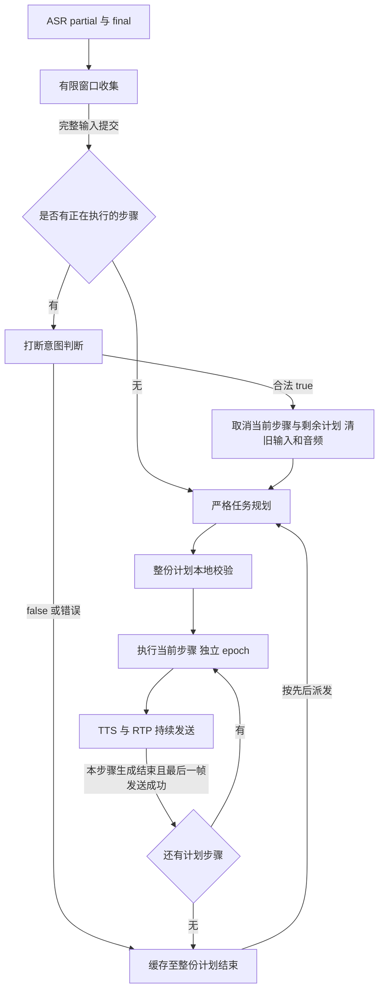

# dev：跨 ASR final 合并与复合任务规划

本说明对应 `dev` 分支新增实现。原交付材料的 A/B/C、附加 D 和历史证据保留；本次改变的运行规则以本文和更新后的架构图为准。

## 1. 输入合并规则

腾讯 ASR 的一个 final 可能只是用户整句话的一段。因此生产入口从 `Manager.Accept` 改为 `Manager.AcceptASR`：先收集原始识别事件，形成逻辑输入，再送给打断分类器或任务规划器。

| 规则 | 当前实现 |
| --- | --- |
| 普通 final | 等待 800ms 后提交；窗口内的新句可加入 |
| 含“等一下、等会、稍后”等等待表达 | 等待 1400ms，给“再去种地”留出续说机会 |
| 收到续句 partial | 暂停静默提交，等待该句 final；不拿已完成前缀执行 |
| 来源边界 | 同一 ASR 会话；音频时间戳可用时，相邻句音频间隔不超过 1500ms，不能倒序 |
| 合并上限 | 最多 6 个来源句、2000 个 Unicode 字符；越限丢弃整组，不执行前缀 |
| 最长收集 | 首个 final 后最多 6 秒；单句尚无 final 时从首个 partial 起最多等 15 秒 |
| 到期时仍有 partial | 丢弃整组，记住来源 ID，迟到 final 不复活 |
| ASR 断线、手动停止、连接关闭或确认打断 | 丢弃尚未提交的合并组 |
| 去重 | 合并句沿用首个来源 ID；全部来源 ID 均记入有限去重表 |

例如在窗口内收到 `s:1 等一下。` 和 `s:2 再去种地。`，下游只看到一次完整的“等一下。 再去种地。”。原始字幕继续显示两段，页面另显示“本次输入 · 2 段合并”。

VAD 和原始 ASR partial 仍可触发 50% duck；合并收集期间的文本标为 `Provisional`，不能发起硬打断判断。只在完整逻辑输入提交后请求 LLM。非打断输入仍采用 false 兜底和 FIFO 缓存。

**代价**：普通停止/切换指令也增加约 800ms 的 final 后等待；等待表达增加约 1400ms。它们是本地合并窗口，另有云 ASR、意图请求和 RTP 时钟耗时，不能当作总响应延迟。保留 `Accept` 供已定稿逻辑输入及原状态机组件测试使用；那些 partial 提前确认测试不代表当前生产入口仍提前确认。

窗口外、不同会话或音频间隔超限会形成独立输入。已经提交并执行的句子不会事后合并，也不会复活已取消任务。持续讲话或后半句丢失超过上述上限时需要重新发出完整请求。

## 2. 有序规划与严格协议

生产动作路由调用 `Client.PlanActions`，使用独立 [plan.md](../internal/llm/prompts/plan.md)。它输出一个原生 `execute_plan` function call，参数形如：

```json
{"steps":[{"action":"plant","text":"种菜"},{"action":"water","text":"浇水"},{"action":"fertilize","text":"施肥"}]}
```

六类能力保持不变，支持 1 至 6 步。`先种菜，再浇水，最后施肥` 按顺序执行；`先浇水，再回答一加一等于几` 拆成动作和包含实际问题的问答步骤。每个农务/亲密步骤仍重复固定台词十次，同一动作可以在不同明确位置重复执行。

规划 prompt 要求先检查整个请求，否定和已取消动作不加入计划；条件、循环、定时、二选一、超过六步或包含不支持操作时，整体交给一个 `general_qa` 澄清，不只执行支持的部分。真实游戏的地块、库存、依赖条件及并行调度不在本实现中。

协议采用 `tools`、`tool_choice:required`、非思考模式、温度 0、最多 768 token；官方 DeepSeek 使用 Beta strict 地址。服务端仍独立检查：单个 choice、无正文和 refusal、`finish_reason=tool_calls`、恰好一个合法 ID 的 `execute_plan`、完整参数对象、步骤数量、白名单 action、非空 text、重复键、未知字段和尾随内容。**整份计划校验成功之前不执行任何步骤**。供应商 strict 不能替代本地校验。

格式错误最多在原 5 秒总期限内修正一次，拒绝和请求错误不做格式修正；失败会记录原因并播报“任务没能启动”。模型语义仍可能判断错误，schema 只能约束格式和范围，不能证明与用户意图一致。

## 3. 生命周期与打断范围



- 每份多步计划有 `plan_id`，每步有独立 `response_epoch` 和 `tool_call.id`。后续步骤使用已验证结果，不再次调用规划器。
- 文本生成完或 TTS 返回并不等于步骤完成；必须等本步待播和待重试帧全部发送成功才推进下一步。
- false 输入等待整个计划。比如三步计划第一步期间夸赞，不会插在第一、二步之间。
- 硬打断仍只接受合法 `{"interrupt":true}`；清当前工具、LLM/TTS 请求、音频队列、全部待执行步骤和旧输入缓存，保留触发句建立新轮。
- 手动停止和断开取消整份计划；步骤执行或合成失败也终止剩余步骤，不自动重试已执行动作。旧回调检查 context/epoch，不能安装旧计划或重新入队。
- 跨步骤时尚未返回的意图请求会随旧 epoch 取消，并用新步骤上下文重新判断；已经明确 false 的缓存不会因为正常步骤切换而重新打断。

步骤完成在这里指**服务端音频发送完成**。浏览器缓冲和物理耳机播放没有确认回执；不能保证 UI 显示完成那一刻耳机尾音也已消失。

## 4. 事件与追踪

| 事件 | 主要字段与用途 |
| --- | --- |
| `input_merge` | `collecting/committed/discarded`、逻辑 `utterance_id`、`source_utterance_ids`、合并文本与原因 |
| `input_rejected` | 超限、未收到 final 等原因，页面明确提示本句未收录 |
| `plan_status` | `plan_id`、`step_index/step_count`、所有步骤的 pending/running/completed/cancelled/failed 快照 |
| `plan_step_transition` | 旧/新 epoch、计划 ID、当前步骤序号，标识计划内自然推进 |
| `tool_status` | 当前工具、步骤 ID、epoch，属于计划时同时附带计划及进度 |
| `intent_result` / `response_cancelled` | 保留原布尔判定、fallback、取消时仍活动的请求、丢弃音频帧数 |

自动统计将后续步骤记为 `planned`，与 `direct`、`interrupted`、`deferred` 分开。后续步骤的延迟保留原请求的 final 和句末时间，包含有意等待前面步骤的时间。

## 5. 回归方法

本地测试不消耗云额度：

```powershell
E:/go/bin/go.exe test ./...
E:/go/bin/go.exe vet ./...
node --test scripts/acceptance_stats.test.cjs
```

`merge_test.go` 和 `plan_test.go` 使用可控时钟与替身，覆盖跨 final 延后、单独停止到期、断句边界、长首句、缺尾句、超限整体拒绝、断线和手动清理、规划一次/逐步发送、缓存晚于整份计划、步骤失败、旧计划迟到返回、跨步骤意图重判。`llm/plan_test.go` 校验完整协议与 HTTP 取消。UI 测试检查五种宽度、合并状态、六步长文本、取消按钮、旧事件隔离及文本不能成为 HTML。

固定云验收更新为 `home-acceptance-v2-plan`：73 例，其中 29 个动作/规划用例、44 个打断用例。计划按有序数组严格比较，顺序错、少步骤、多步骤都失败。增加“去胶水”在农务命令中按“去浇水”理解的回归，同时“胶水怎么做”保持问答；这是 LLM 的上下文规则，未全局替换原始字幕。媒体集 `home-media-v2-plan` 在原五场景上增加三步计划、打断清剩余计划、真实跨 final 等待语句三个场景。

```powershell
npm install --prefix bin/browser-check --no-save playwright
$env:NODE_PATH = (Resolve-Path 'bin/browser-check/node_modules').Path
$env:GO_BIN = 'E:/go/bin/go.exe'
node scripts/verify_acceptance.cjs --repeat 1
```

验收会新建隔离端口，生成必要的固定麦克风 WAV，调用实际云服务，记录源码摘要、用例和音频哈希、原始事件与统计。`--merge` 必须先收到腾讯实际 final“等一下”，再播放续句，且最终观察到至少两个来源 ID 合并；不会注入伪造 final 来冒充真实 ASR 验证。

单独测试已运行的 dev 服务：

```powershell
$env:DEMO_URL = 'http://localhost:8081'
$env:EVIDENCE_DIR = 'bin/dev-media'
node scripts/verify_plan.cjs --sequence
node scripts/verify_plan.cjs --cancel
node scripts/verify_plan.cjs --merge
node scripts/verify_ui.cjs
```

上述媒体脚本需要固定音频已由完整验收或 `go run ./cmd/demo-fixtures -scene home-plan` 等场景生成。不会录制或上传用户视频。

## 6. 本次结果

2026-09-13 最终验收全部通过。云服务为腾讯 ASR `16k_zh_en_2.0`、DeepSeek `deepseek-v4-pro`、腾讯流式 TTS `101016`。完整 [报告](evidence/dev-plan-20260913/final/report.md)、[统计 JSON](evidence/dev-plan-20260913/final/summary.json)保留实际用例快照、音频哈希和源码摘要；运行时 HEAD 为分支基线，未提交实现由 `source_sha256` 标识。

| 检查 | 结果 |
| --- | --- |
| `go test ./...` / `go vet ./...` | 全部通过 |
| 统计测试 `node --test scripts/acceptance_stats.test.cjs` | 6/6，含计划顺序、数量及延迟分组 |
| UI | 1440、1024、768、390、320px 全通过，含长文本、图片、波形像素和旧事件隔离 |
| 真实文本规划与打断 | 73/73，每例一次；29 个规划、44 个意图用例 |
| 真实媒体 | 8/8，每场景一次；双向 RTP、非零下行能量、旧轮取消后恢复事件为 0 |
| Go race detector | 未执行成功：当前 Go 配置未启用 cgo，命令返回 `-race requires cgo` |

关键证据：

- [顺序计划](evidence/dev-plan-20260913/final/media/ordered-plan-1/plan-sequence.json)：`plant → water → fertilize → general_qa`，前面三步属于同一计划，问答在整份计划完成后派发；动作规划总共调用两次。
- [取消计划](evidence/dev-plan-20260913/final/media/cancel-plan-1/plan-cancel.json)：种菜中直接说“去收菜”，只执行 `plant → harvest`；浇水、施肥变为 cancelled，旧缓存没有派发。
- [真实跨 final](evidence/dev-plan-20260913/final/media/cross-final-wait-1/plan-merge.json)：`15:48:59.247Z` 提交“等一下。 再去种地。”，来源为同一会话的 `:2`、`:3`；`15:49:00.076Z` 返回唯一一次 false（828ms，无 fallback），浇水保持并在完成后种菜。
- [桌面 UI](evidence/dev-plan-20260913/ui-desktop.png)、[手机长文本 UI](evidence/dev-plan-20260913/ui-mobile-long.png)是前端状态夹具截图，用于排版和转义检查，不冒充真实语音实录。

本次文本规划耗时 P50/P95 为 1040/1241ms，意图请求为 737/951ms。四次浏览器控制事件中的 true 到 cancel 间隔为 0 至 8ms，**不等于从开口到打断或耳机停止的耗时**。合并等待、ASR 和判定耗时另计；完整报告将后续计划步骤的有意等待单列。

保留的失败与修正：

1. [第一轮文本报告](evidence/dev-plan-20260913/initial-text/report.md)为 67/69：模型把“先浇水，再把访客踢出去”误拆成 water/general_qa；七步请求被本地数量校验拒绝。强化整份请求先检查的 prompt 后复测通过。首轮是文本协议测试，没有真的执行这份错误计划；schema 仍不能保证未来语义绝不误判。
2. 中间一轮媒体 6/8。两次初始“去浇水”被识别成“去胶水”，规划进入普通问答，测试按原期望失败。保留 [延后场景](evidence/dev-plan-20260913/asr-wait-before-fix.json)和 [替换场景](evidence/dev-plan-20260913/asr-replacement-before-fix.json)。补充农务命令语境的同音理解及普通胶水问题反例后，最终使用相同旧音频复测通过。

以上为固定合成语音和有限文本样本，不能当作真人噪声、外放回声、所有停顿时长或物理耳机尾音的测量。用户录制的正式打断过程仍独立维护，本次未加入任何视频。
