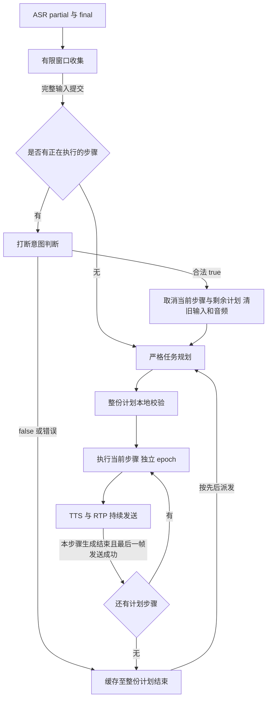

# dev：跨 ASR final 合并与复合任务规划

本说明对应 `dev` 分支新增实现。原交付材料的 A/B/C、附加 D 和历史证据保留；本次改变的运行规则以本文和更新后的架构图为准。

## 1. 输入合并规则

腾讯 ASR 的一个 final 可能只是用户整句话的一段。因此生产入口从 `Manager.Accept` 改为 `Manager.AcceptASR`：先收集原始识别事件，形成逻辑输入，再送给打断分类器或任务规划器。

| 规则 | 当前实现 |
| --- | --- |
| 普通 final | 等待 800ms 后提交；窗口内的新句可加入 |
| 含“等一下、等会、稍后”等等待表达 | 等待 1400ms，给“再去种地”留出续说机会 |
| 收到续句 partial | 暂停静默提交，等待该句 final；不拿已完成前缀执行 |
| 来源边界 | 同一 ASR 会话；音频时间戳可用时，相邻句音频间隔不超过 1500ms，不能倒序 |
| 合并上限 | 最多 6 个来源句、2000 个 Unicode 字符；越限丢弃整组，不执行前缀 |
| 最长收集 | 首个 final 后最多 6 秒；单句尚无 final 时从首个 partial 起最多等 15 秒 |
| 到期时仍有 partial | 丢弃整组，记住来源 ID，迟到 final 不复活 |
| ASR 断线、手动停止、连接关闭或确认打断 | 丢弃尚未提交的合并组 |
| 去重 | 合并句沿用首个来源 ID；全部来源 ID 均记入有限去重表 |

例如在窗口内收到 `s:1 等一下。` 和 `s:2 再去种地。`，下游只看到一次完整的“等一下。 再去种地。”。原始字幕继续显示两段，页面另显示“本次输入 · 2 段合并”。

VAD 和原始 ASR partial 仍可触发 50% duck；合并收集期间的文本标为 `Provisional`，不能发起硬打断判断。只在完整逻辑输入提交后请求 LLM。非打断输入仍采用 false 兜底和 FIFO 缓存。

**代价**：普通停止/切换指令也增加约 800ms 的 final 后等待；等待表达增加约 1400ms。它们是本地合并窗口，另有云 ASR、意图请求和 RTP 时钟耗时，不能当作总响应延迟。保留 `Accept` 供已定稿逻辑输入及原状态机组件测试使用；那些 partial 提前确认测试不代表当前生产入口仍提前确认。

窗口外、不同会话或音频间隔超限会形成独立输入。已经提交并执行的句子不会事后合并，也不会复活已取消任务。持续讲话或后半句丢失超过上述上限时需要重新发出完整请求。

2026-09-14 补充了第 8 节的缓存关系判断：原始窗口外的独立输入，如果尚未执行且后句只是前句的补充条件，可以在派发前合并。它与上述 ASR 收集窗口是两个阶段。

## 2. 有序规划与严格协议

生产动作路由调用 `Client.PlanActions`，使用独立 [plan.md](../internal/llm/prompts/plan.md)。它输出一个原生 `execute_plan` function call，参数形如：

```json
{"steps":[{"action":"plant","text":"种菜"},{"action":"water","text":"浇水"},{"action":"fertilize","text":"施肥"}]}
```

六类能力保持不变，支持 1 至 6 步。`先种菜，再浇水，最后施肥` 按顺序执行；`先浇水，再回答一加一等于几` 拆成动作和包含实际问题的问答步骤。每个农务/亲密步骤仍重复固定台词十次，同一动作可以在不同明确位置重复执行。

规划 prompt 要求先检查整个请求，否定和已取消动作不加入计划；条件、循环、定时、二选一、超过六步或包含不支持操作时，整体交给一个 `general_qa` 澄清，不只执行支持的部分。真实游戏的地块、库存、依赖条件及并行调度不在本实现中。

协议采用 `tools`、`tool_choice:required`、非思考模式、温度 0、最多 768 token；官方 DeepSeek 使用 Beta strict 地址。服务端仍独立检查：单个 choice、无正文和 refusal、`finish_reason=tool_calls`、恰好一个合法 ID 的 `execute_plan`、完整参数对象、步骤数量、白名单 action、非空 text、重复键、未知字段和尾随内容。**整份计划校验成功之前不执行任何步骤**。供应商 strict 不能替代本地校验。

格式错误最多在原 5 秒总期限内修正一次，拒绝和请求错误不做格式修正；失败会记录原因并播报“任务没能启动”。模型语义仍可能判断错误，schema 只能约束格式和范围，不能证明与用户意图一致。

## 3. 生命周期与打断范围



- 每份多步计划有 `plan_id`，每步有独立 `response_epoch` 和 `tool_call.id`。后续步骤使用已验证结果，不再次调用规划器。
- 文本生成完或 TTS 返回并不等于步骤完成；必须等本步待播和待重试帧全部发送成功才推进下一步。
- false 输入等待整个计划。比如三步计划第一步期间夸赞，不会插在第一、二步之间。
- 硬打断仍只接受合法 `{"interrupt":true}`；清当前工具、LLM/TTS 请求、音频队列、全部待执行步骤和旧输入缓存，保留触发句建立新轮。
- 手动停止和断开取消整份计划；步骤执行或合成失败也终止剩余步骤，不自动重试已执行动作。旧回调检查 context/epoch，不能安装旧计划或重新入队。
- 跨步骤时尚未返回的意图请求会随旧 epoch 取消，并用新步骤上下文重新判断；已经明确 false 的缓存不会因为正常步骤切换而重新打断。

步骤完成在这里指**服务端音频发送完成**。浏览器缓冲和物理耳机播放没有确认回执；不能保证 UI 显示完成那一刻耳机尾音也已消失。

## 4. 事件与追踪

| 事件 | 主要字段与用途 |
| --- | --- |
| `input_merge` | `collecting/committed/discarded`、逻辑 `utterance_id`、`source_utterance_ids`、合并文本与原因 |
| `input_rejected` | 超限、未收到 final 等原因，页面明确提示本句未收录 |
| `plan_status` | `plan_id`、`step_index/step_count`、所有步骤的 pending/running/completed/cancelled/failed 快照 |
| `plan_step_transition` | 旧/新 epoch、计划 ID、当前步骤序号，标识计划内自然推进 |
| `tool_status` | 当前工具、步骤 ID、epoch，属于计划时同时附带计划及进度 |
| `intent_result` / `response_cancelled` | 保留原布尔判定、fallback、取消时仍活动的请求、丢弃音频帧数 |

自动统计将后续步骤记为 `planned`，与 `direct`、`interrupted`、`deferred` 分开。后续步骤的延迟保留原请求的 final 和句末时间，包含有意等待前面步骤的时间。

## 5. 回归方法

本地测试不消耗云额度：

```powershell
E:/go/bin/go.exe test ./...
E:/go/bin/go.exe vet ./...
node --test scripts/acceptance_stats.test.cjs
```

`merge_test.go` 和 `plan_test.go` 使用可控时钟与替身，覆盖跨 final 延后、单独停止到期、断句边界、长首句、缺尾句、超限整体拒绝、断线和手动清理、规划一次/逐步发送、缓存晚于整份计划、步骤失败、旧计划迟到返回、跨步骤意图重判。`llm/plan_test.go` 校验完整协议与 HTTP 取消。UI 测试检查五种宽度、合并状态、六步长文本、取消按钮、旧事件隔离及文本不能成为 HTML。

固定云验收更新为 `home-acceptance-v2-plan`：73 例，其中 29 个动作/规划用例、44 个打断用例。计划按有序数组严格比较，顺序错、少步骤、多步骤都失败。增加“去胶水”在农务命令中按“去浇水”理解的回归，同时“胶水怎么做”保持问答；这是 LLM 的上下文规则，未全局替换原始字幕。媒体集 `home-media-v2-plan` 在原五场景上增加三步计划、打断清剩余计划、真实跨 final 等待语句三个场景。

```powershell
npm install --prefix bin/browser-check --no-save playwright
$env:NODE_PATH = (Resolve-Path 'bin/browser-check/node_modules').Path
$env:GO_BIN = 'E:/go/bin/go.exe'
node scripts/verify_acceptance.cjs --repeat 1
```

验收会新建隔离端口，生成必要的固定麦克风 WAV，调用实际云服务，记录源码摘要、用例和音频哈希、原始事件与统计。`--merge` 必须先收到腾讯实际 final“等一下”，再播放续句，且最终观察到至少两个来源 ID 合并；不会注入伪造 final 来冒充真实 ASR 验证。

单独测试已运行的 dev 服务：

```powershell
$env:DEMO_URL = 'http://localhost:8081'
$env:EVIDENCE_DIR = 'bin/dev-media'
node scripts/verify_plan.cjs --sequence
node scripts/verify_plan.cjs --cancel
node scripts/verify_plan.cjs --merge
node scripts/verify_ui.cjs
```

上述媒体脚本需要固定音频已由完整验收或 `go run ./cmd/demo-fixtures -scene home-plan` 等场景生成。不会录制或上传用户视频。

## 6. 本次结果

2026-09-13 最终验收全部通过。云服务为腾讯 ASR `16k_zh_en_2.0`、DeepSeek `deepseek-v4-pro`、腾讯流式 TTS `101016`。完整 [报告](evidence/dev-plan-20260913/final/report.md)、[统计 JSON](evidence/dev-plan-20260913/final/summary.json)保留实际用例快照、音频哈希和源码摘要；运行时 HEAD 为分支基线，未提交实现由 `source_sha256` 标识。

| 检查 | 结果 |
| --- | --- |
| `go test ./...` / `go vet ./...` | 全部通过 |
| 统计测试 `node --test scripts/acceptance_stats.test.cjs` | 6/6，含计划顺序、数量及延迟分组 |
| UI | 1440、1024、768、390、320px 全通过，含长文本、图片、波形像素和旧事件隔离 |
| 真实文本规划与打断 | 73/73，每例一次；29 个规划、44 个意图用例 |
| 真实媒体 | 8/8，每场景一次；双向 RTP、非零下行能量、旧轮取消后恢复事件为 0 |
| Go race detector | 未执行成功：当前 Go 配置未启用 cgo，命令返回 `-race requires cgo` |

关键证据：

- [顺序计划](evidence/dev-plan-20260913/final/media/ordered-plan-1/plan-sequence.json)：`plant → water → fertilize → general_qa`，前面三步属于同一计划，问答在整份计划完成后派发；动作规划总共调用两次。
- [取消计划](evidence/dev-plan-20260913/final/media/cancel-plan-1/plan-cancel.json)：种菜中直接说“去收菜”，只执行 `plant → harvest`；浇水、施肥变为 cancelled，旧缓存没有派发。
- [真实跨 final](evidence/dev-plan-20260913/final/media/cross-final-wait-1/plan-merge.json)：`15:48:59.247Z` 提交“等一下。 再去种地。”，来源为同一会话的 `:2`、`:3`；`15:49:00.076Z` 返回唯一一次 false（828ms，无 fallback），浇水保持并在完成后种菜。
- [桌面 UI](evidence/dev-plan-20260913/ui-desktop.png)、[手机长文本 UI](evidence/dev-plan-20260913/ui-mobile-long.png)是前端状态夹具截图，用于排版和转义检查，不冒充真实语音实录。

本次文本规划耗时 P50/P95 为 1040/1241ms，意图请求为 737/951ms。四次浏览器控制事件中的 true 到 cancel 间隔为 0 至 8ms，**不等于从开口到打断或耳机停止的耗时**。合并等待、ASR 和判定耗时另计；完整报告将后续计划步骤的有意等待单列。

保留的失败与修正：

1. [第一轮文本报告](evidence/dev-plan-20260913/initial-text/report.md)为 67/69：模型把“先浇水，再把访客踢出去”误拆成 water/general_qa；七步请求被本地数量校验拒绝。强化整份请求先检查的 prompt 后复测通过。首轮是文本协议测试，没有真的执行这份错误计划；schema 仍不能保证未来语义绝不误判。
2. 中间一轮媒体 6/8。两次初始“去浇水”被识别成“去胶水”，规划进入普通问答，测试按原期望失败。保留 [延后场景](evidence/dev-plan-20260913/asr-wait-before-fix.json)和 [替换场景](evidence/dev-plan-20260913/asr-replacement-before-fix.json)。补充农务命令语境的同音理解及普通胶水问题反例后，最终使用相同旧音频复测通过。

以上为固定合成语音和有限文本样本，不能当作真人噪声、外放回声、所有停顿时长或物理耳机尾音的测量。用户录制的正式打断过程仍独立维护，本次未加入任何视频。

## 7. 故事请求误打断与历史状态修复（2026-09-14）

### 7.1 失败原因

用户在浇水播放中说“给我讲个故事吧”，界面随后回答“我先去给植物浇水啦……故事……再慢慢讲”。本机 2026-09-13 23:55:30 的[日志摘录](evidence/story-context-20260914/user-failure-excerpt.txt)显示，意图模型返回合法 true，`fallback=false`、耗时 460ms，取消了浇水 epoch 2，当时 `tts_active=true`，清除了 250 帧待播音频。新 epoch 3 进入 `general_qa`，但正文又安排浇水、推迟故事。摘录仅保留必要状态事件，隐藏会话标识；截图中的回答不冒充日志中未记录的正文。

这是两处问题叠加：普通内容请求被误当成即时动作切换；聊天历史又只保存“去浇水”等自然语言，没有同步已取消或已完成的执行事实。模型据此自行推测旧任务仍需完成。旧版 73/73 文本与 8/8 媒体结果没有覆盖这个祈使句式和回答正文，不能据此判定此场景已验收通过。

### 7.2 修复方案

1. 意图 prompt 明确区分能力与语气。“给我讲个故事吧”“讲个笑话”“帮我解释……”属于通用问答；“给我”“帮我”和新话题本身不表示立即停止。没有独立停止/优先指令时返回 false；“先别浇水了，给我讲个故事吧”返回 true。现有直接切换农务动作的规则仍适用。
2. [context.go](../internal/dialogue/context.go)单独维护最近 12 次响应的执行事实：epoch、动作、completed/cancelled/failed、取消的剩余计划动作。事实在实际生命周期终点记录，提供给规划器和问答模型，不依赖助手历史台词推断状态。
3. `general_qa` 真正开始时，追加实时 system 上下文，再将当前步骤的问题作为最后一个 user 消息。服务端已经决定此刻派发问答，模型应直接回答；排队和后续工具调度由服务端负责，不能再次承诺“忙完再讲”或重启历史农务。
4. 结构化执行事实仅含服务端字段，不将用户话语或模型生成正文拼接成高优先级指令。`completed` 仍只表示语音发送完成，不代表真实游戏操作完成。
5. 新增 `response_context` 控制事件，记录实际提供给问答模型的状态，便于关联 `intent_result → input_buffered/response_cancelled → tool_status → response_context → response_text`。状态消息不作为 TTS 正文。

这仍是 LLM 语义判定，不是关键词硬拦截。JSON mode 与严格解析保证非法响应不能授权硬打断；合法 true 的语义错误仍需通过规则和回归降低，不能保证未来永不误判。

### 7.3 回归方法

- `context_test.go` 使用可控时钟和模型替身，分别验证水任务完成、取消、失败后，规划器和问答模型拿到正确状态；检查普通故事等待旧音频发送完，取消/失败清剩余计划，状态不进入正文且历史有界。
- 固定文本集升级为 `home-acceptance-v3-story`：83 例，其中 31 个动作/规划和 52 个意图用例。新增普通故事、笑话、解释、翻译，明确停止和优先回答反例，以及完成/取消历史下只规划当前故事。
- 媒体集升级为 `home-media-v3-story`：10 场景。新增 [verify_story.cjs](../scripts/verify_story.cjs)两条真实链路，分别检查普通请求排队、明确停止取消，并核对模型收到的状态及最终回答正文。
- 正文自动断言检查最小长度、旧农务重启/延期承诺和状态泄漏；保留完整回答供人工阅读。正则和长度不能证明任意输出的故事质量，不能用仅有 `general_qa completed` 代替内容验收。

单独复测需先生成 `home`、`home-story` 固定音频并启动最新 dev 服务：

```powershell
E:/go/bin/go.exe run ./cmd/demo-fixtures -scene home
E:/go/bin/go.exe run ./cmd/demo-fixtures -scene home-story
$env:DEMO_URL = 'http://localhost:8081'
$env:EVIDENCE_DIR = 'bin/story-evidence'
node scripts/verify_story.cjs --deferred
node scripts/verify_story.cjs --interrupt
```

浏览器依赖和完整验收命令同第 5 节。每次真实调用都会消耗 ASR、LLM、TTS 额度；固定输入不等于真人麦克风或物理耳机录制。

### 7.4 本次结果

首轮[完整报告](evidence/story-context-20260914/initial/report.md)为文本 82/83、媒体 9/10，保留原始失败，未覆盖或改写历史报告：

- 旧用例 `action-praise-de` 的“干的不错”被规划成 `general_qa`，应为 `affection`。补清夸赞是支持的亲密操作、否定亲密才转问答的边界后复测。
- 普通故事媒体的调度已经正确：false 入缓存、water completed 后讲出了完整短故事。但测试初版要求至少 60 字，误判这个短故事为失败。将短确认过滤阈值改为 20 字，保留旧任务重启、延期承诺和状态泄漏检查；故事质量仍通过阅读实际正文确认。初版失败记录保持原样，不事后改成通过。

补充夸赞规则后的[文本报告](evidence/story-context-20260914/final-text/report.md)连续三轮全部通过：83 × 3 = **249/249**，其中动作/规划 93/93、打断意图 156/156；错误与兜底均为 0，重复标签无波动。本次原始结果与首轮分开，不把重复样例当作独立用户样本。

[本地回归](evidence/story-context-20260914/local-regression.json)中 `go test ./...`、`go vet ./...`、6 个统计测试均通过；Go JSON 中有 137 个测试通过事件，含子测试与缓存命中，不作为云端样本量。race 未新增执行，仍受当前 cgo 配置限制。

最终运行版本的[语音专项报告](evidence/story-context-20260914/final-media/report.md)为 **3/3**：普通故事、明确停止后讲故事、首次夸赞。三条链路均无分类兜底，取消后的旧 epoch 恢复事件为 0。表中时间均为 UTC，换算北京时间需加 8 小时。

| 场景 | 关键证据与正文 |
| --- | --- |
| [普通故事](evidence/story-context-20260914/final-media/story-deferred.json) | `16:18:52.869 false → 52.870 input_buffered → 16:19:07.806 water completed → 07.807 input_dispatched → 08.741 general_qa running`。状态为 water completed；回答讲述寻找星星的实际短故事，没有再安排浇水或延期。故事期间接收音频能量增量约 1.852。 |
| [明确停止](evidence/story-context-20260914/final-media/story-interrupted.json) | `16:20:19.530 true → 19.666 response_cancelled，丢弃 250 帧 → 20.342 general_qa running`。状态为 water cancelled；随后输出伙伴相遇的实际故事，能量增量约 1.549。开头“我这就浇不了啦”措辞不够自然，仍保留完整正文；功能正确不等于风格已经完善。 |
| [首次夸赞](evidence/story-context-20260914/final-media/home-praise-voice.json) | `plant → false/缓存 → plant completed → affection`，无需重试，十次亲密台词完成。 |

最终媒体与 249 次文本使用相同运行代码和 prompt。两份报告的源码摘要不同，仅因为媒体脚本将误伤短故事的 60 字门槛改为 20 字及相应诊断文字；生成媒体摘要时恢复这三处文本后，摘要与文本报告完全一致，`runtime_matches_text_snapshot=true`。首轮另外八个既有媒体场景通过，但它们发生在补充夸赞规则之前，保留在首轮报告中，不与最终三条专项拼成“同一版本完整 10/10”。

本次服务运行在 `http://localhost:8081/`，更新服务后须刷新并重新连接。源码、prompt、测试、文档与合成语音产生的事件可提交；本机 `.env` 和用户视频不进入仓库。

## 8. 缓存请求的补充条件合并（2026-09-14）

### 8.1 原因与规则

用户在浇水期间先说“给我讲个故事吧”，约七秒后补充“要和夜晚和月亮相关的”。[原始事件摘录](evidence/queued-continuation-20260914/user-failure-excerpt.txt)显示，两句分别在 00:27:15 和 00:27:22 返回 false，浇水结束后却生成了 epoch 4、epoch 5 两轮问答。

旧实现只合并 800/1400ms 窗口内的 ASR 断句，缓存仍是逐条 FIFO，没有识别“后句修饰尚未执行的前句”。第一轮故事碰巧包含月亮，不代表补充条件已经传入模型；判断是否合并必须检查最终请求文本和实际派发次数。

新增 [continuation.go](../internal/dialogue/continuation.go)在当前整份计划结束、缓存尚未派发时检查相邻两条输入。使用独立 [continuation.md](../internal/llm/prompts/continuation.md)，结果只有 `{"continuation":true}` 或 `{"continuation":false}`，不能授权硬打断。

| 情况 | 处理 |
| --- | --- |
| 故事 + 夜晚/月亮主题、长度、风格、受众等条件 | true，将两段原文连为一个逻辑请求，只规划并回答一次 |
| 原主题 + 明确更正主题 | true，保留原文及更正，规划器按整句处理 |
| 连续多个补充 | 合并后继续检查下一条，最多六个 ASR 来源、2000 字符 |
| 故事 + 独立知识问题、再讲另一个故事、夸赞或新动作 | false，保留独立输入并按顺序派发 |
| 不同 ASR 会话、超过合并上限 | 不合并、不截断，完整输入分别保留 |
| 下一条还在 partial | 暂缓队首派发，直到 final 或原有未完成输入超时清理；不拿草稿生成答案 |
| 关系请求超时、拒绝、非法格式或网络错误 | false 兜底，保留两条输入并记录原因；可能仍分别回答，不能冒充合并成功 |
| 手动停止、连接关闭、确认打断清缓存 | 同时取消关系请求；迟到 true 不能恢复任务 |

只处理尚未派发的相邻输入，不对已经开始或结束的回答做事后合并，也不跨过独立请求去猜更早的指代。原 ASR 合并窗口及打断 true/false 规则保持原职责。关系请求每次最多 2 秒，无格式重试；只有一条缓存时不增加这次请求。多个补充可能有多次关系请求，并不承诺零等待。

### 8.2 执行和证据

服务端保留首条逻辑输入 ID，追加来源 ID 和后句原文；被合并后句不再独立派发。规划 prompt 明确“故事 + 限定条件”是同一个问答步骤，`response_context.text`记录实际传给回答模型的子请求，防止只看输出碰巧命中主题。

`input_relation`记录 checking/completed/error、严格布尔结果、耗时、fallback 和原因；合并成功发出 `input_merge status=committed reason=queued_continuation`。前端原始字幕仍保留各 ASR 句，下面的“本次输入”显示“2 段合并”和完整内容。播放结束但缓存仍待处理时，停止按钮保持可用。

严格布尔客户端由打断和补充关系复用，仍使用 JSON mode、温度 0、非思考模式、32 token 及本地逐 token 校验。本次也补齐供应商 `message.refusal`检查：即使 content 同时包含合法 true，也必须拒绝并返回错误；调用方明确兜底 false。

### 8.3 回归结果

[完整报告](evidence/queued-continuation-20260914/full/report.md)记录 `home-acceptance-v4-continuation` 的 **98/98**，包含 32 个动作/规划、52 个打断、14 个补充关系用例。新增 15 个相关用例额外各测三轮，**45/45**，见[重复专项](evidence/queued-continuation-20260914/repeat/summary.json)。两组独立记录，不把重复样例算作独立用户。

本次选择四个真实媒体回归，**4/4**，不是完整十二场景复测：

- [故事补充](evidence/queued-continuation-20260914/full/media/story-amendment-1/story-amendment.json)：UTC `16:46:44.665` 缓存故事，`16:46:52.733` 缓存主题，间隔约 8 秒；`16:47:00.048` 浇水完成，关系判断 473ms 后 true，合成“给我讲个故事吧。 要和夜晚和月亮相关的。”并仅派发一次。回答模型实际输入包含两段，正文讲述夜晚循着月光回家的故事，只有一个 `general_qa` epoch，没有预留第二轮、独立派发后句或遗留缓存。
- [独立问题](evidence/queued-continuation-20260914/full/media/story-independent-1/story-independent.json)：故事加一加一，关系 false，先后两轮分别回答，不误吞第二个问题。
- [清旧缓存](evidence/queued-continuation-20260914/full/media/discard-old-buffer-1/home-clear-buffer-voice.json)：确认打断后旧缓存仍被清除，不恢复旧问题。
- [原窗口跨 final](evidence/queued-continuation-20260914/full/media/cross-final-wait-1/plan-merge.json)：“等一下”与“再去种地”仍合成完整输入并返回 false，待浇水结束再种菜。

[本地回归](evidence/queued-continuation-20260914/local-regression.json)通过 `go test ./...`、`go vet ./...`、7 个统计测试、五种宽度的 UI 回归及待处理队列的停止按钮检查。新增组件测试覆盖超过七秒的补充、连续三段、独立输入、不同会话、数量/文本上限、非法输出/超时兜底、partial 等待或丢弃、停止/关闭后的迟到结果；HTTP 测试覆盖严格字段及 refusal 与合法 true 共存。race 仍未运行，环境未启用 cgo。

复现命令（浏览器依赖与 Go 路径同第 5 节）：

```powershell
node scripts/verify_acceptance.cjs --repeat 1 --media-case story-amendment --media-case story-independent --media-case discard-old-buffer --media-case cross-final-wait
```

省略 `--media-case` 会运行当前全部十二个媒体场景。也可对已启动的 dev 服务执行 `node scripts/verify_story.cjs --amendment` / `--independent`，需预先生成 `home`、`home-story`、`home-switch` 音频夹具。统计将关系判断耗时和兜底单列，不能混入打断误/漏率。真人回声、物理耳机尾音和已开始回答后的补充修订均不属于本次已验证范围。

## 9. TTS 播放期间麦克风被抑制（2026-09-14）

用户反馈“去种地”只剩“地”或“墓地”，进一步确认本地波形仅在 TTS 播放时接近直线，播放结束后恢复。波形位于浏览器采集侧，早于 RTP、ASR 和输入合并；不能把这个现象直接归因为 ASR 分类、词表或跨 final 合并。

### 9.1 现场定位

新增浏览器诊断、ASR 原文和发送进度日志后，取得[开启音频处理的片段](evidence/tts-capture-20260914/before.txt)：01:20:12 开始播放时，浏览器音轨仍为 live、未静音、AudioContext 为 running；包数持续增加，服务端序列缺口为零，ASR 队列只有少量待组包帧、WebSocket 写耗时为 0ms。但采集信号接近静音，直到播放结束后才再次完整识别故事请求。用户确认这与其讲话时波形归零的现象一致。线程堆栈检查没有发现轮次锁、ASR 回调或网络发送卡死，不能仅用“没有识别结果”证明阻塞。

前端此前无论耳机或外放都开启 `echoCancellation`、`noiseSuppression`、`autoGainControl`。本次按用户耳机环境关闭三项，再取得[耳机模式片段](evidence/tts-capture-20260914/headphones.txt)：

| 时间 | 事件 |
| --- | --- |
| 01:28:11 | 第一轮 TTS 正在播放 |
| 01:28:13 | 浏览器采集 RMS 约 2.07%，能量增加；三项音频处理实际设置均为 false |
| 01:28:15 | 播放尚未结束，ASR final 为“给我讲个故事吧。” |
| 01:28:24 | 故事 TTS 开始播放 |
| 01:28:29 | 故事播放期间，ASR final 为“去种地。” |

这支持播放期间的采集前处理抑制输入这一方向，且两条现场短指令在关闭处理后能够识别。不把本次组合开关对照解释为已经单独定位了 AEC、降噪、自动增益或底层驱动中的某一项；也不能证明所有设备均已解决。master 与 dev 在此前使用相同采集参数，因此尚不能从代码差异解释为何用户感知到只在 dev 出现。

用户在耳机模式复测后明确反馈：“播放时也能正常识别了。”这是本次设备上的人工确认，范围限于该现场复测。

### 9.2 修正范围

- 收听方式默认“耳机”，三项处理关闭；“外放”保留原来的三项处理，避免直接回采助手的声音。模式在连接前选择，连接期间禁用；Chrome 实测已有音轨的 `applyConstraints` 不能可靠切换这些效果，所以没有依赖热切换。
- 波形改为 Float32 采样，避免 8 位量化把微弱信号显示为严格零；保留音频图节点引用，记录轨道与 AudioContext 状态并尝试恢复被暂停的波形上下文。不放大或改写上传音频。
- ASR 原文、音频发送进度、队列、RTP 序列缺口和慢回调日志用于区分采集抑制、上行异常、识别无结果和业务处理迟滞。检测到一段声音后超过三秒无 final 会提示“完整识别结果暂未返回”；它是诊断提示，不能把噪声认定为已识别的人声。
- `-diagnostics` 开启本机浏览器元数据与线程堆栈端点。浏览器诊断不包含音频或识别正文；服务端原文日志只保存在本机日志中。公开证据仅保留必要片段，不包含视频、密钥或用户录音。

没有启用热词、强制文本替换、提高 VAD 音量阈值或更改打断规则；排查阶段试验的异步队列改造已撤回，未以未经现场证实的“锁阻塞”作为最终修复。

### 9.3 验证与限制

`go test ./...`、`go vet ./...`、五种宽度的 UI 回归通过。[采集专项](evidence/tts-capture-20260914/capture-stress.json)通过 1800 个 dev 页面事件、显式 GC、AudioContext 暂停恢复，并使用 Chrome 原生虚拟麦克风验证新建耳机/外放音轨时三项设置实际生效。该自动测试证明采集与设置逻辑，不代替物理耳机双讲测试；现场两条播放期 ASR 结果单独见上述片段。

排查时还有一个绕开 WebRTC/LLM/TTS、直接送腾讯 ASR 的[合成音频探针](evidence/tts-capture-20260914/synthetic-asr-probe.json)：正常音量、0.1 倍音量、静音十二秒后正常音量三次“去种地”，实际仅返回正常音量的两次，结果 **2/3，未通过**。这个失败说明无识别结果不一定由本地阻塞引起，不作为本次耳机模式修复的通过证据。未重跑全部固定云验收，也未运行 race。

```powershell
# 本机诊断服务，凭证沿用 .env。
go run ./cmd/server -addr :8081 -diagnostics
# NODE_PATH 等浏览器依赖配置同第 5 节。
node scripts/verify_capture.cjs
```
