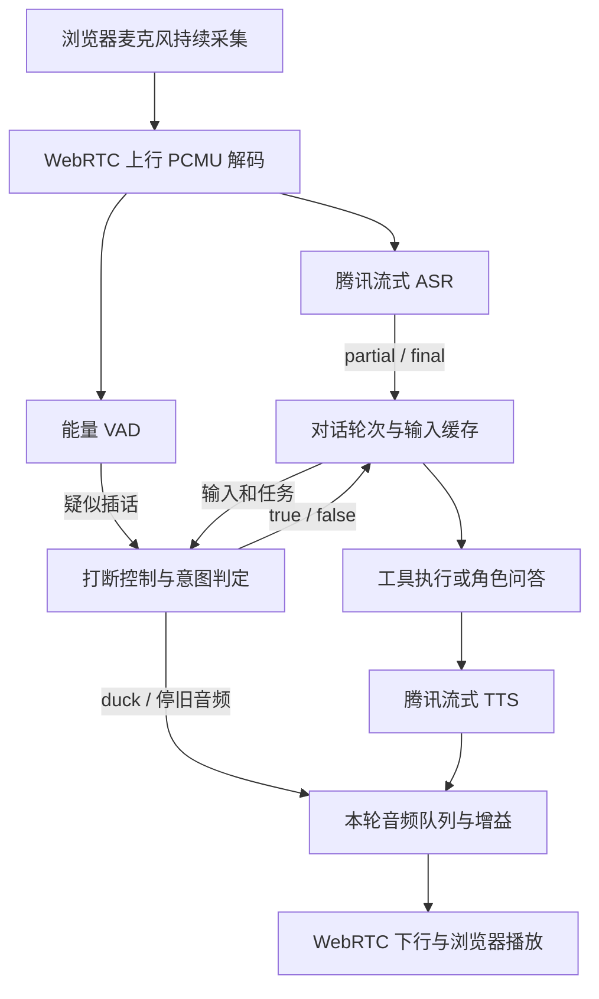
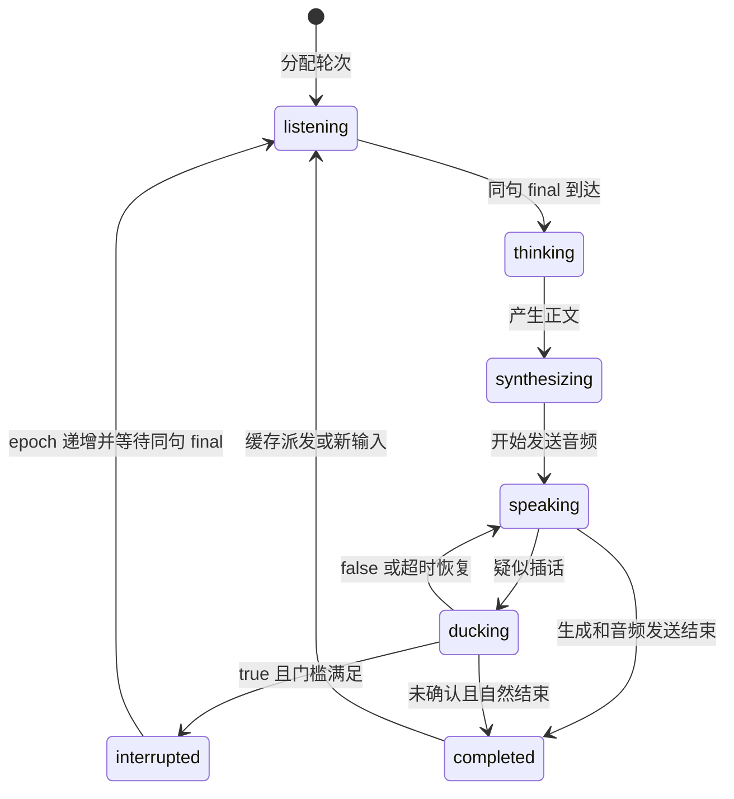

# 全双工语音打断实验报告

本文按《全双工语音打断实验（面试作业说明书）》的条目对应作答。A、B、C 保留原模块名称及各说明项；D 为本项目补充的技术实现；E 对应 Word 原模块 D“效果测试与对比分析（可选）”。最后单列运行方式、演示步骤和交付物。未开展的对照实验和待填写的打断过程记录保留空位。

`dev` 已补充跨 final 合并与顺序任务规划，当前规则更新在 C/D；原实录与 E 中统计保留历史版本口径，本次验收单独见 [dev 扩展说明](dev-跨final合并与任务规划.md)。

## 模块 A：场景选择与全双工方案分析

### A.1 场景基本信息

**对应要求：用户是谁、AI 在播什么、用户为什么会中途插话；为什么需要全双工，而不是按键说话或播完再听。**

本实验选择《洛克王国：世界》的家园管理助手。用户是管理家园的玩家，AI 是已经唤起的驻派精灵迪莫。家园驻派、看家和种后浇水来自用户提供的场景设定；当前没有连接真实游戏客户端。

AI 播报的是当前动作的执行台词，或对玩家问题的回答。浇水、种菜、收菜、施肥和亲密互动均以固定台词重复十次模拟，普通问答由 LLM 生成。玩家会在播报中途修改安排，例如种菜中改成“去施肥”；也可能只是说“迪莫你真棒”或提出稍后回答的问题。

按键说话要求玩家额外操作，并不能自然表达随时插话；播完再听会错过执行期间的新指令。因此本项目在播报中持续采集和识别，先降低音量，再判断是立即切换还是缓存到当前任务结束。这里要验证的是语音交互闭环，游戏动作本身以语音模拟。

### A.2 交互时序

**对应要求：从用户开口到 AI 开口，再到用户抢话；标出麦克风是否一直开、上下行是否同时存在。**

| 阶段 | 用户与 AI 的行为 | 麦克风和上行 | 下行和轮次处理 |
| --- | --- | --- | --- |
| 用户开口 | “去种菜”进入 ASR，陆续得到 partial/final | 始终开启，持续发送 RTP | 下行音轨保持连接，空闲时发静音 |
| AI 开口 | final 经动作分类进入 `plant`，播报“我正在种菜。” | 不关闭、不因播放而忽略 ASR | TTS 音频持续下行；上下行同时存在 |
| 用户抢话 | 播放中说“去施肥” | 继续采集并送 ASR | 旧轮先降至 50% 音量，生成与播放仍继续 |
| 确认打断 | LLM 判断新指令应立即替换当前农务 | 继续接收这句话的后续语音 | 取消旧轮、清队列、建立新 epoch |
| 新轮回答 | 使用触发句 final 执行 `fertilize` | 仍持续采集，允许下一次插话 | final 未到则先等待；到达后生成并播放新回答 |
| 非打断分支 | 若说的是“种完菜再去施肥”或普通问题 | 同样持续采集 | false 后恢复音量，缓存完整输入，旧任务完成后再处理 |

### A.3 全双工定义

**对应要求：说明是真全双工、近全双工还是伪全双工；播放时如何继续采集和识别。**

本项目按作业中的“近全双工”定义实现：浏览器在同一 WebRTC 会话中持续发送麦克风音轨并接收 AI 音轨；服务端的上行读取、ASR、下行发送分别运行。播放、duck 和意图判断都不停止麦克风，也不丢弃播放期间的识别输入。

它具有同时收发的媒体能力，但不等于零延迟或完全消除回声。ASR 断句、LLM 判定、网络和浏览器播放缓冲会影响响应；浏览器回声消除只是请求启用，没有证明所有设备都达到同样效果。实际播放中仍产出 ASR 的证据见 B.4。

### A.4 技术选型

**对应要求：WebRTC 栈、信令、ASR/LLM/TTS 或 mock 方案，以及在 2～3 天实验范围内这样选的理由。**

| 环节 | 选择 | 理由 |
| --- | --- | --- |
| 服务端 / WebRTC | Go + Pion WebRTC | 在同一进程处理 SDP、RTP 和轮次取消，便于用 context 管理并发任务 |
| 信令 | HTTP 自定义 SDP offer/answer | 足够打通浏览器与服务端；减少实验所需的额外信令组件 |
| ASR | 腾讯实时 WebSocket，当前 `16k_zh_en_2.0` | 使用现成流式 partial/final；匹配当前开通的资源包 |
| LLM | DeepSeek `deepseek-v4-pro`，非思考模式 | 按用户选型承担打断判断、动作分类和角色问答，无需部署模型 |
| TTS | 腾讯 `TextToStreamAudioWS` | 音频分片到达即可发送，无需等待整段合成结束 |
| 音频格式 | WebRTC PCMU / 8kHz / 单声道；云接口侧 PCM16LE | 编解码简单，TTS 选 8kHz；ASR 声明实际输入为 8kHz，由云端升采样 |
| 状态通道 | WebRTC DataChannel `control` | 汇总字幕、工具、队列、epoch 和打断事件，便于演示与定位问题 |

这些选择把工作量集中在作业要求的媒体链路和取消闭环。ASR、LLM、TTS 的主路径使用真实服务；工具动作的语音模拟及自动测试输入的降级边界见 B.5。

### A.5 链路简图

**对应要求：在报告中画图，至少包含浏览器/客户端、WebRTC、ASR、对话轮次、TTS/播放、打断控制。**

图中上行链路不会因下行播放而关闭。信令和更细的控制关系另见 [架构与状态机说明](架构与状态机说明.md)。

## 模块 B：WebRTC 全双工媒体链路

### B.1 建连方式

**对应要求：说明 WHIP / 自定义 SDP / 其他方式，给出关键接口或信令步骤。**

本项目使用自定义 SDP 交换，关键接口为 `POST /api/offer`，请求为 `{"type":"offer","sdp":"..."}`，响应为 `{"type":"answer","sdp":"..."}`。

1. 浏览器申请麦克风，创建 `RTCPeerConnection`，加入麦克风音轨并创建 `control` DataChannel。
2. 浏览器生成 offer，设置本地描述，等待 ICE 收集结束，再提交接口。
3. Go/Pion 设置远端 offer、创建 answer、设置本地描述，并等待本端 ICE 收集结束。
4. 浏览器接收并设置 answer，建立双向媒体和控制通道。

实现见 [信令处理](../internal/signaling/http.go)和 [RTC 会话](../internal/rtc/session.go)。当前只有一个浏览器会话，新连接会关闭旧连接。本地使用 localhost；远程浏览器申请麦克风需 HTTPS。本实验未做完整 ICE 优化与长期弱网处理。

### B.2 上行音频

**对应要求：麦克风采集、编码、服务端如何接收。**

浏览器通过 `getUserMedia` 采集，申请 `echoCancellation`、`noiseSuppression`、`autoGainControl`，将麦克风 track 加入 WebRTC。服务端协商 PCMU / 8000Hz / 单声道，在独立循环中 `ReadRTP()`，将 PCMU 解码为 PCM16LE。

同一份音频一方面计算 RMS 交给能量 VAD，另一方面持续送给腾讯 ASR。ASR 分片为 3200 字节 / 200ms；VAD 不裁剪 ASR 输入。当前 V2 引擎声明 `input_sample_rate=8000`，由腾讯升采样后识别，服务端将 `sentence_list` 转为统一 partial/final 事件，并去重已定稿句子。

ASR 有独立有限队列，识别积压不阻塞 RTP 接收；超过约 2 秒积压时报告识别错误。播放期间正常接收的具体证据见 B.4，错误时解除降音的规则见 C.5。

### B.3 下行音频

**对应要求：TTS 或预录音频如何送入 WebRTC 音轨并播放。**

动作工具输出固定台词；通用问答输出 LLM 流式正文。正文按句提交腾讯流式 TTS，收到 PCM16LE 分片后转换为 PCMU，进入所属 epoch 的待播队列。跨分片保留未满的样本和帧，避免每个网络分片之间插入静音。

服务端每 20ms 发送一帧、每帧 160 个 PCMU 字节，经同一条长期存在的下行 track 到浏览器 `<audio>` 播放。待播上限为 250 帧，约 5 秒；队列满通过背压限制合成推进。没有有效回答音频时发送静音，保持轨道连续。

“本轮完成”要求生成结束且音频已全部发送，不能仅因工具已产出十句文本就派发下一个任务。这个完成点是服务端发送边界，尚不是耳机实际播放结束的精确回执。

### B.4 全双工证据

**对应要求：证明 AI 播放时麦克风仍在采集，可用时间戳、音轨状态或录屏。**

以下摘自 [2026-09-13 ASR V2 真实媒体记录](evidence/asr-v2-20260913/home-clear-buffer-voice.json)。时间为当日 UTC，北京时间加 8 小时。

| 时间 | 事件 | 对全双工的意义 |
| --- | --- | --- |
| 03:16:40.675 | `response_status speaking epoch=1` | 种菜旧轮进入下行播放 |
| 03:16:43.202 | 新句 `asr_final`：“1+1等于几？” | 旧轮播放中仍收到并识别了新的上行输入 |
| 03:16:44.039 | 该问题 `input_buffered` | 输入未被播放状态忽略，按非打断规则缓存 |
| 03:16:45.207 / 46.251 | 下一句 partial“去” / final“去施肥。” | 旧轮未停止时，上行和 ASR 继续工作 |
| 03:16:47.335 | `response_cancelled epoch=1` | 取消发生在上述新输入之后 |

同场景浏览器发送 RTP 1798 包、286400 字节，接收 1791 包、286560 字节，接收音频能量约 2.4743。包数和非零能量证明双向媒体有效；“speaking 到取消之间出现新句 ASR”才是同时工作的时序证据。

此记录的输入是 WebAudio 虚拟麦克风，不代表真人设备的采集质量已验收。真人演示可同时展示页面波形、字幕和服务端 `inbound audio` 日志；待填的过程记录见最终交付项。

### B.5 降级说明

**对应要求：说明文件播放、localhost 回环或 mock TTS 的使用，以及它们为何不改变打断实验结论。**

| 项目 | 实际使用方式 | 能支持的结论与限制 |
| --- | --- | --- |
| localhost | 浏览器与 Go 服务在同机连接，ASR/LLM/TTS 仍访问云服务 | 能验证 WebRTC 双向媒体与取消闭环；不能代表跨公网、NAT 或弱网效果 |
| 固定音频输入 | 自动媒体验收用预合成 WAV 经 WebAudio 虚拟麦克风送进真实 WebRTC，物理输出静音 | ASR、语义判断和取消链未被替换；不能代表真人咳嗽、外放回声和耳机尾音 |
| 动作语音模拟 | 农务和亲密操作用十次台词模拟，实际调用腾讯流式 TTS | 能演示长任务中插话及取消；没有证明游戏里的地块或角色状态被真实修改 |
| 测试替身 | Go 测试使用可控 LLM/TTS、时钟或本地 WebSocket，制造并发与迟到回调 | 用于验证取消和协议边界；与真实云端媒体证据分别列出，不作为主路径演示 |

当前交互主路径的 ASR、LLM、TTS 均为真实服务，没有将打断判定或取消过程 mock 掉。早期固定下行测试只属于链路调试，不作为当前完整对话验收的替代。

## 模块 C：语音打断（Barge-in）实现

本项目采用 Word 建议的两阶段：疑似插话先 duck；确认后取消旧轮、清待播、切换新 turn，等待触发句 final 后回答。下面按原说明项展开。

### C.1 打断触发源

**对应要求：说明 VAD、ASR partial、能量、按钮或组合，以及选择理由。**

疑似插话由能量 VAD 或另一句有效 ASR 文本触发。能量路径直接使用上行 PCM 的 RMS，先发现持续声音，降低旧轮音量；ASR 文本则补足能量检测遗漏，并提供语义判断输入。这两种信号只启动候选阶段，VAD 和关键词均不能直接授权硬打断。

确认来源是独立 LLM 意图分类器的合法 true。这样可以区分“去施肥”和“等种完再去施肥”，以及“停一下”与普通夸赞。页面停止按钮作为人工控制，通过 DataChannel 发送带目标 epoch 的 `stop_response`；语音演示不依赖按钮代替识别。

### C.2 确认条件

**对应要求：给出最短字数、持续时间、语气词和回声处理等条件、阈值及理由。**

| 条件 | 当前规则 | 选择理由与作用 |
| --- | --- | --- |
| 能量疑似说话 | PCM16 RMS ≥ 700，按 20ms 帧连续约 200ms | 降低短促脉冲直接触发候选的概率；阈值是当前实验参数，未按多设备标定 |
| duck 幅度 | 下行样本乘 0.5，约 -6dB | 留出用户说话空间，同时保留当前任务的可听反馈 |
| ASR partial | `dev` 收集为逻辑输入草稿，只触发候选降音 | 不拿未说完的前缀授权取消 |
| 普通 final 与停止表达 | final 后等 800ms 合并窗口，提交后请求 LLM | 可合并相邻云端分句，代价是增加停止等待 |
| 等待类表达 | “等一下”等 final 后等 1400ms；续句 partial 等待完整 final | 允许“等一下。再去种地。”跨 final 形成一次完整判断 |
| 请求节奏 | 生产路径按已提交逻辑输入判断；步骤切换可重判未完成请求 | 原 partial 三次/500ms 策略保留在旧逻辑入口的组件测试中 |
| LLM 判定期限 | 最长 2 秒；仅合法 `{"interrupt":true}` 授权硬切 | 无法得到有效判断时保守保留旧任务 |
| 硬切前等待 | 已播放时，当前 duck 阶段至少 120ms；未开始播放时可直接取消生成 | 播放中必须先经历降音；不是 true 之后一律再等 120ms |
| 语气词和回声 | prompt 将“嗯/啊”、否定、引用等判为非打断；浏览器请求回声消除 | 没有声源识别或字幕回读匹配器，不能保证所有回声均排除 |

语义判定还受当前活动约束：

| 当前活动 | 新输入 | 判定与后续 |
| --- | --- | --- |
| 种菜 | 去施肥 | true，直接切到不同农务，无需额外停止口令 |
| 浇水 | 等一下再去种地 | false，当前任务结束后再种菜 |
| 种菜 | 去种地 | false，同义动作按缓存规则处理 |
| 施肥 | 迪莫你真棒 | false，完成后亲密互动 |
| 种菜 | 一加一等于几 | false，完成后回答 |
| 种菜 | 先别种菜了，回答我一加一等于几 | true，明确暂停后切到问答 |

输出采用 JSON mode 加本地完整解析，拒绝额外正文、围栏、重复键、额外字段和非布尔值。非法输出、截断、超时和请求失败按 false 兜底，事件带 `fallback=true`、`status=error` 和原因。文本式拒绝不符合 schema 时也落入该路径；供应商独立 `message.refusal` 字段的专门处理和组合回归仍待补齐，不能笼统称所有拒绝形态均已覆盖。

### C.3 取消范围

**对应要求：分别交代前端播放、服务端 TTS、LLM 生成、旧 turn 和待播队列。**

| 对象 | 确认打断后的行为 | 边界 |
| --- | --- | --- |
| 前端播放 | 同一远端音轨继续接收，服务端停止提供旧 epoch 内容，等待期间下发静音，再接新音频 | 不以 `audio.pause()` 作为语音打断；已进入浏览器缓冲的尾音无法从服务端撤回 |
| 服务端 TTS | 取消旧轮 context，关闭仍活动的 TTS WebSocket；迟到分片拒绝入队 | 取消本地连接不等于已证明云端内部计算或计费立即停止 |
| LLM 生成与分类 | 取消绑定旧轮的生成、动作分类和意图请求；迟到返回校验 epoch/版本 | 已经结束的请求无需再次取消；不能把所有日志都解释为 LLM 当时仍活跃 |
| 旧 turn 和工具 | 旧轮进入 `interrupted`，已启动工具和剩余计划进入 `cancelled`，不再恢复 | 当前工具是语音执行器，没有真实游戏动作的撤销回执 |
| 待播音频 | 清空旧队列及待重试帧，后续发送前继续校验所属轮次 | 清队列只影响尚未发送的内容 |
| 其他输入缓存 | 保留触发句，清掉其他 final、草稿及对应判定请求 | 对应用户补充的“打断时缓存也不要”；后续新输入仍可缓存 |

确认过程在服务端轮次管理器的锁内完成。顺序是保留触发句并清其他输入，取消旧 context、清音频，再分配新 epoch。仅 final 已到的情况下立即处理新请求；否则新轮先进入 `listening`。

### C.4 轮次管理

**对应要求：turn_seq 或等价机制如何递增；旧结果如何丢弃，避免旧音频重新出现。**

使用单调递增的 `response_epoch` 标识回答轮次，每轮有独立 context、工具状态和音频队列。硬确认调用 `confirmLocked`，取消旧轮后通过 `reserveLocked` 分配新 epoch，并发出 `turn_transition`，同时记录 `previous_epoch` 和触发句 `utterance_id`。

输入句子 ID 与回答 epoch 是两套标识。`dev` 合并输入沿用首个来源 ID，记住全部来源 final；每个计划步骤分配独立 epoch，属于同一 plan_id。生产路径在完整合并输入提交后才分配响应轮次。旧逻辑入口仍支持 partial 预留后等待 final，已有组件测试继续保留。被丢弃的 ID 也会记住，避免旧问题因迟到结果重新入队。

每个异步意图请求另有文本版本。ASR 改写或补长会取消旧请求，未实施的 true 也可撤回；回调必须同时匹配当前轮次和版本。音频入队、待重试帧和最终发送都受旧轮取消状态约束。false 则恢复音量，将完整输入按 FIFO 等待，不能提前启动下一轮覆盖当前任务。

### C.5 误打断处理

**对应要求：至少讨论回声、咳嗽、语气词或环境噪声中的一类，说明抑制方案。**

| 误触发来源 | 当前抑制与恢复 | 仍存在的限制 |
| --- | --- | --- |
| 短促噪声或咳嗽 | 约 200ms 连续能量门槛；即使触发也先 duck，需语义 true 才硬切 | 持续咳嗽可能越过门槛，ASR 也可能误转写 |
| “嗯/啊”等附和 | 语义分类预期 false，恢复旧音量；固定文本集覆盖这两类输入 | 文本分类通过不代表真实噪声不会被识别成其他命令 |
| 扬声器回声、字幕回读 | 浏览器请求 AEC/降噪；录制建议耳机；使用当前任务与新输入上下文判断 | 未实现专用回声来源鉴别和字幕相似度过滤，尚缺系统性外放测试 |
| “等一下再去种地” | `dev` 在有限窗口内跨 final 合并后判断 | 超出窗口、不同会话或音频间隔大于 1500ms 仍视为独立输入，不能事后撤回已执行取消 |

无有效确认时，VAD 连续约 500ms 低于阈值判断说话结束，再给予 800ms 确认余量后恢复；仅文本触发且无活跃 VAD 时也设置恢复期限。连续疑似声音最多 duck 4 秒。ASR 不可用时解除未确认 duck。合法 false、异常兜底和候选超时都不取消旧任务。

### C.6 打断状态机与日志对应

**对应要求：在报告中给出状态机，至少覆盖 listening / speaking / ducking / interrupted，且能对应日志。**

上图画播放中插话的主路径。`ducking` 是叠加候选状态，生成或合成期间也能触发，恢复时回到当时的工作阶段。未开始播放的旧轮无需等待可听 duck；手动停止和任务失败还有 `interrupted` / `failed` 路径，详见独立状态机说明。

| 状态或事件 | 日志 / 控制字段 | 可以观察到什么 |
| --- | --- | --- |
| `listening` | `response_status status=listening response_epoch=N` | 已分配新轮，等待触发句 final |
| `speaking` | `response_status status=speaking` | 当前轮进入音频发送阶段，首个非静音帧另看指标 |
| `ducking` | `response_status status=ducking`；服务端 `duck gain=0.50` | 正在降低旧轮音量 |
| 确认结果 | `intent_result interrupt=true/false`、输入 ID、latency | 哪一句被判为打断；异常另带 fallback 和原因 |
| `interrupted` | `response_cancelled`、`response_status status=interrupted` | 旧轮取消及丢弃帧数，而不只是页面改变状态 |
| 新轮切换 | `turn_transition previous_epoch=N response_epoch=N+1` | 新旧轮与触发句的关联 |

### C.7 最低实现标准与闭环证据

**对应要求：用户在 AI 播报中途明确插话，系统停止旧播报，并开始处理新问题。**

在 B.4 的真实 V2 记录中，“去施肥”是当前种菜任务的明确替换指令。事件链如下，日期同为 2026-09-13 UTC：

| 时间 | 事件 | 对应闭环步骤 |
| --- | --- | --- |
| 03:16:44.630 | 旧轮 `ducking` | 先疑似插话、降低音量 |
| 03:16:46.251 | final：“去施肥。” | 取得触发句完整结果 |
| 03:16:46.316 | `speaking reason=unconfirmed` | 确认尚未到达时曾恢复音量，实际过程不是持续 duck |
| 03:16:47.202 | `interrupt=true`，再次 duck | 合法判定授权切换 |
| 03:16:47.335 | `response_cancelled epoch=1 queue_dropped=250 tts_active=true` | 取消活跃合成、清旧待播及旧输入缓存 |
| 03:16:47.336 | 旧工具 cancelled、旧轮 interrupted、`turn_transition 1→2` | 停旧轮并将触发句交给新轮 |
| 03:16:47.954 | `fertilize running epoch=2` | 开始执行新请求 |
| 03:16:48.556 | `asr_final_to_first_audio_ms=2306` | 新轮首个非静音帧已发送 |

该记录中 final 早于 true，因此切轮后直接处理完整句。partial 提前确认时“先切轮，等待 final 再回答”的路径由 `TestFullClosedLoopStartsNewGenerationOnlyAfterFinal` 验证；`TestConfirmedInterruptionCancelsActiveLLMAndStreamingTTS` 使用两个同时活跃的替身验证双方取消及迟到音频隔离。真实媒体记录只显示当时 TTS 活跃，不能声称同时观察到了云 LLM 和 TTS 都在生成。

另有 [明确停止并替换的真实媒体记录](evidence/acceptance-20260912/media/explicit-replacement-1/home-replacement-voice.json)，输入为“先别浇水了，去施肥”；该记录采用旧 ASR `8k_zh`。完整分析、测试名称与原始材料见 [测试情况与证据链分析](测试情况与证据链分析.md)。

## 模块 D：补充技术实现（本项目扩展）

本模块按用户补充要求，说明 Word A、B、C 之外的场景功能。它不是 Word 原模块 D 的对比实验，后者对应本文 E。

### D.1 多项工具定义与调用边界

服务端定义六种原生 `tool_call`，参数均为完整空对象 `{}`。工具名称、说明和固定语音集中在 [home.go](../internal/home/home.go)。

| 工具 | 场景作用 | 当前执行形式 |
| --- | --- | --- |
| `water` | 浇水 | “我正在浇水。”十次 |
| `plant` | 种菜、种地、种田 | “我正在种菜。”十次 |
| `harvest` | 收菜 | “我正在收菜。”十次 |
| `fertilize` | 施肥 | “我正在施肥。”十次 |
| `affection` | 夸赞、鼓励或亲密请求 | “贴贴。”十次 |
| `general_qa` | 问答、闲聊、不支持操作或澄清 | 加载角色 Skill 后生成回答，不重复十次 |

`dev` 在六类能力上增加有序规划：“先浇水再施肥”生成两步，最多六步；整份计划校验成功后逐步执行，每步语音发送完成才推进下一步。不同动作替换仍按 C 的意图规则确认，true 取消整份旧计划和旧缓存。条件、循环、定时、超限或不支持的计划整体澄清；不支持并行游戏任务。详细规则与新测试见 [dev 扩展说明](dev-跨final合并与任务规划.md)。

`Executor.Execute(ctx, Request, speak)` 为后续游戏接入留接口；请求包含调用 ID、epoch 和用户文本。当前 `VoiceExecutor` 只生成语音台词。接游戏后仍需实现幂等、取消回执和已发生动作的处理，不能把当前语音模拟视为游戏操作已完成。

### D.2 工具状态与播放生命周期

工具状态和回答状态分开：一个工具在 `running` 期间，回答可能处于 thinking、synthesizing、speaking 或 ducking。事件同时携带 `tool_call.id`、工具名和 `response_epoch`，便于区分“哪个动作”和“哪一轮”。

| 事件 / 状态 | 触发时机 | 设计目的 |
| --- | --- | --- |
| `action_result status=classified` | 动作分类通过校验 | 确认本轮选择哪个工具 |
| `tool_status running` | 分类成功、开始执行工具或问答 | 页面显示当前任务；意图分类器可使用当前工具上下文 |
| `tool_status completed` | 本轮生成结束，且本轮音频全部发送 | 防止十句文本产出完就过早执行缓存任务 |
| `tool_status cancelled` | 轮次被打断、停止或关闭 | 让任务状态随取消闭环结束，旧回调不能改回 running |
| `tool_status failed` | 已开始的工具随轮次失败 | 区分执行失败和正常取消 |
| `plan_status` / `plan_step_transition` | 计划状态快照或自然推进下一步骤 | 追踪完整计划与各步骤，区别于中途打断切轮 |

若分类本身失败，还没有合法工具可进入 running，通过 `action_result` 的 fallback、reason、validation 记录，并播报任务未能启动。工具执行器返回只表示文本生产结束，不代表播放完成。实现见 [动作执行](../internal/dialogue/action.go)和 [轮次管理器](../internal/dialogue/manager.go)。

### D.3 两个分类器

| 分类器 | 输入 | 输出及消费方 | 主要职责 |
| --- | --- | --- | --- |
| 打断意图分类器 | 新 ASR 文本、partial/final、当前工具、当前回答和最近用户请求 | 严格 `{"interrupt":true}` / `{"interrupt":false}`，交轮次管理器 | 决定现在替换任务还是等待；不生成口语回复 |
| 动作规划器 | 已提交逻辑输入和最近对话历史 | 一个原生 `execute_plan`，含 1 至 6 步 action/text | 决定做什么及执行顺序，区分执行、问答、夸赞、否定和引用 |

两者使用独立 prompt，避免口语角色要求把解释性文字混入控制协议。[interruption.md](../internal/llm/prompts/interruption.md)约束何时打断，[plan.md](../internal/llm/prompts/plan.md)约束工具规划。旧 `ClassifyAction` 接口为兼容测试保留。

规划请求使用 `tool_choice:required`；官方 DeepSeek 地址采用 Beta strict 工具模式。本地仍验证单一调用、合法 ID、步骤数量、白名单 action、非空 text、无重复键及额外正文；校验失败不能先执行前几步。格式错误可在 5 秒总期限内重试一次；拒绝、供应商错误、网络失败及超时不做格式重试。打断分类器的 false 兜底和严格 JSON 规则见 C.2，两者的异常结果都记录日志，不把协议内容送进 TTS。

### D.4 角色 Skill

[迪莫角色 SKILL.md](../internal/home/skills/dimo/SKILL.md)是应用运行时的角色文件，通过 `go:embed` 编译进程序，供通用问答的 system 消息加载。它固定已唤起的迪莫身份、简短中文和伙伴语气，要求知识不确定时直说，缺少游戏实时数据时不能编造作物、库存或执行结果。

角色 Skill 不持有密钥，不替代动作分类器和打断控制，也不自行决定重复次数。农务台词由服务端工具产生；更换角色语气不应改变工具协议。当前没有名字唤醒、驻派角色动态切换或多精灵管理。这样先固定单角色和权限边界，保持演示可解释。

### D.5 缓存与场景调度

非打断的完整逻辑输入按先后顺序缓存，当前整份计划发送完成后派发；partial 只维护草稿。缓存最多 8 句，每句最多 2000 字符。合并组最多六个来源，首个 final 后最多等六秒；尚无 final 的首句最多收集十五秒。未完成或越限输入整组丢弃，队列满显式提示本句未收录。

确认打断时保留触发句并清空其他缓存；同文本的新问题用新的输入 ID 区分，不能误当成被清理的旧问题。本项目回归专门覆盖“先缓存一加一问题、切施肥时丢弃、施肥期间重新问后正常回答”。这使语义优先级、任务生命周期和输入缓存保持一致。

### D.6 角色音色与界面观测

当前 TTS 使用腾讯 `101016`（智甜）作为接近迪莫感觉的清亮童声，不是官方迪莫原声。音色和角色 prompt 分开配置，50% duck 由服务端音频增益处理。

家园主题页面保留连接控制、麦克风 RMS/波形、播放器、识别字幕、回答文本、工具状态、轮次、缓存数量和事件日志。UI 的作用是展示链路和状态证据，波形跳动本身不等于 ASR 或打断闭环成功。素材与其他实现细节见 [其他技术说明](其他技术说明.md)。

## 模块 E：效果测试与对比分析（对应 Word 原模块 D，可选）

### E.1 测试集

**对应原 D“测试集”：明确插话、语气词、短暂停顿、AI 刚开口就打断、用户说完再打断。**

| Word 建议场景 | 当前对应测试 | 覆盖状态 |
| --- | --- | --- |
| 明确插话 | “先别浇水了，去施肥”“去施肥”；固定文本和真实媒体 | 已有通过记录 |
| 语气词 | `filler-en`、`filler-ah`，输入“嗯”“啊”预期 false | 通过测试，不造成打断 |
| 短暂停顿 | 等待前缀与补长文本有逻辑测试 | 尚无专门控制停顿长度的真实媒体组 |
| AI 刚开口就打断 | 状态机允许合成和播放阶段取消 | 通过测试，可成功打断 |
| 用户说完再打断 | `TestFinalOnlyInterruptionStillDucksBeforeCancellation`；V2 实录 true 晚于 final | 通过测试 |

完整固定集为 18 个动作用例加 42 个打断用例，默认各测三次；媒体集含延后、首次夸赞、明确替换、直接切换和清旧缓存五种场景。具体输入、预期和回归命令见 [测试文档](测试情况与证据链分析.md)。

### E.2 对比方式与效果对比表

未开展

### E.3 评价维度

**对应原 D“评价维度”：打断时延、误打断、漏打断、旧音频残留、新轮衔接。**

| 维度 | 当前定义和可观察证据 |
| --- | --- |
| 打断时延 | 浏览器收到 true 到 response_cancelled 的间隔；另看触发句 final 到取消，不能把二者混为用户开口到停止 |
| 误打断 / 漏打断 | 对固定预期标签统计，错误 false 兜底也算严格失败；文本结果不代表真实声学误识别率 |
| 旧轮残留 | 检查清队列、迟到音频拒绝和旧 epoch 不再 speaking/completed；未量化耳机缓冲尾音 |
| 新轮衔接 | turn_transition 后启动新工具/回答，并发送首个非静音 RTP 帧；等待 final 的分支另有逻辑测试 |

### E.4 定量记录

**对应原 D“定量记录”：用日志时间戳或手工统计支撑结论。**

2026-09-12 完整基线使用 ASR `8k_zh`：动作 54/54、打断 126/126，误打断 0/60、漏打断 0/66，请求错误 0；五个真实媒体场景均通过，旧轮恢复事件为 0。打断判定请求 P50/P95 为 802/919ms；确认到取消为 130/140ms，共 3 个媒体样本。原始 [固定验收报告](evidence/acceptance-20260912/report.md)可追溯逐例结果。

2026-09-13 V2 专项中，true 到取消为 133ms，触发句 final 到取消为 1084ms，新轮 final 到首个非静音 RTP 为 2306ms；各为该次场景的单样本。它证明新引擎下清缓存切换路径通过，不能代替旧基线五场景在 V2 下全部重跑的结果，也不是半双工与全双工的对照数据。

本次报告修订复核已有证据，没有新增云服务测试。最近的 [本地回归输出](evidence/testing-20260913/local-regression.json)记录 Go 8 个含测试包、vet、统计 4 项和五种尺寸 UI 均通过。详细分母、统计口径和限制见独立测试文档。

### E.5 错误分析：失败案例与第 4 天改进

**案例一：等待安排被提前打断。** “等一下再去种地”曾在 final 前停止浇水，原因是过早使用停止前缀，加上补长文本未充分作废旧判定。当时改为等待类 partial 到 final，并撤销过时请求和未实施的 true。完整句缓存路径回归通过，代价是单独“等一下”也要等 final；本次 `dev` 进一步增加有限窗口内跨 final 合并，见扩展说明。[历史文本](evidence/home-wait-classifier.json)与 [媒体回归](evidence/home-wait-voice.json)保留了原调查材料。

**案例二：噪声导致降音，等待判定时音量往返。** 能量只说明存在声音，早期单频输入曾被 ASR 转写成文字；当前 V2 记录也出现 03:16:46.316 未确认恢复、47.202 得到 true 后再次 duck。watchdog 防止噪声长期压低音量，但与异步判定叠加会产生音量往返，不能只展示理想化状态图。

后续 `dev` 扩展已增加跨 ASR 语句合并、复合任务规划和对应测试，见 [dev 扩展说明](dev-跨final合并与任务规划.md)。上面的历史案例及测试数字保留当时版本口径。
