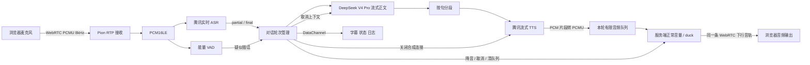
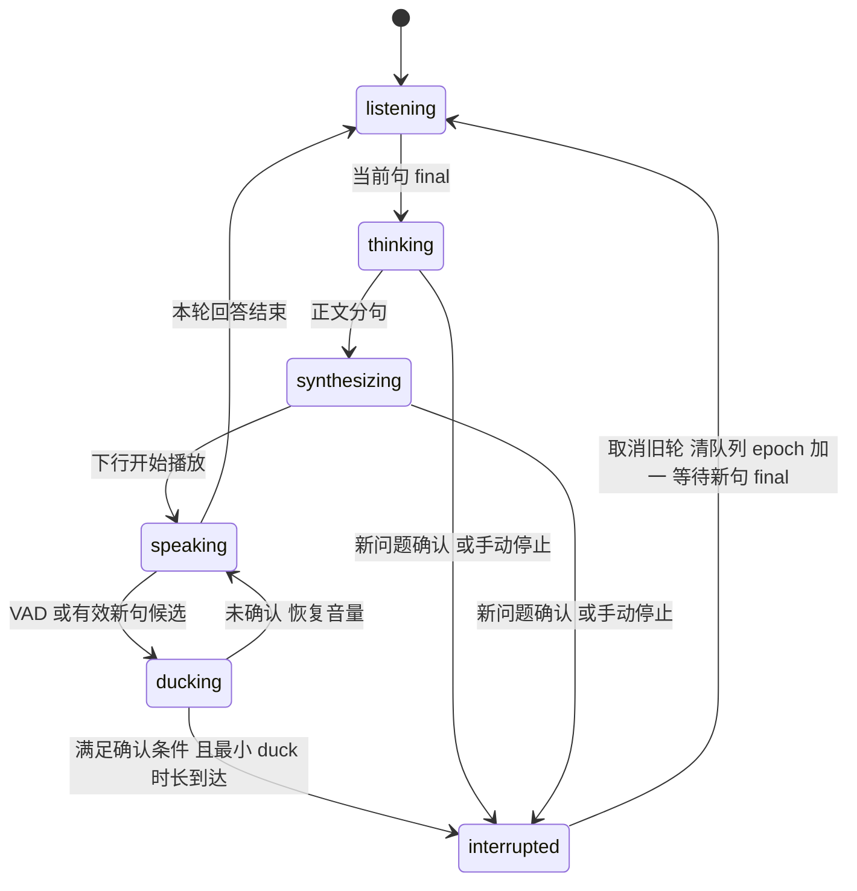

# 全双工语音打断实验 作业任务说明

本文件对应仓库中的《全双工语音打断实验（面试作业说明书）》。“已完成”的描述以当前代码和实际验证为依据；尚未完成的说明项保留标题，正文留空。后续代码修改需要同步维护本文件。

## 模块 A 场景选择与全双工方案分析

### 场景基本信息

场景是面向普通中文用户的语音助手。AI 正在播报故事或简短知识回答时，用户可以中途改换问题，例如从“讲一个小故事”切换为“等一下，请告诉我一加一等于几”。用户改变诉求时不应被迫等整段播报结束，也不必腾出手按键说话，因此需要持续聆听和语音打断。

### 交互时序

浏览器取得麦克风权限后，持续通过 WebRTC 上行发送音频。腾讯 ASR 给出 final 后，服务端启动 DeepSeek V4 Pro 流式生成，按句提交腾讯流式 TTS，收到音频片段后不断送入同一条 WebRTC 下行音轨。播放时麦克风和 ASR 不关闭。

用户插话后先触发服务端 duck；满足确认规则后，取消旧任务、清理待播、递增轮次并进入 `listening`，等待该句 final。final 到达后才为这个已分配的新轮次生成回答。

### 全双工定义

WebRTC 媒体传输是双向同时工作的；对话体验属于近全双工。播放期间上行采集和识别一直运行，但语音断句、云服务处理和浏览器缓冲仍有延迟。浏览器请求回声消除，服务端目前使用能量 VAD，没有独立的声学回声消除器，因此不能承诺外放环境下完全无误打断。

### 技术选型及理由

Go 和 Pion WebRTC 提供服务端媒体链路，自定义 offer/answer 简化本地演示部署。PCMU/8kHz 可由浏览器和 Pion 直接协商，Go 侧可直接解码成腾讯 ASR 所需的 PCM16；腾讯流式 TTS 同样选择 8kHz PCM，避免本阶段引入重采样。

ASR 采用腾讯实时 WebSocket `8k_zh`；LLM 按用户选择使用 `deepseek-v4-pro` 非思考模式，避免播报推理内容；TTS 采用腾讯 `TextToStreamAudioWS`。使用已有云模型，把工作重点放在双向媒体、轮次隔离、取消和打断验证。DataChannel 用于字幕、状态、指标和停止命令。

### 链路简图



## 模块 B WebRTC 全双工媒体链路

### 建连方式及信令步骤

使用非 Trickle ICE 的自定义 SDP。浏览器建立 `RTCPeerConnection`，添加麦克风音轨和 `control` DataChannel，创建 offer，等 ICE 收集结束后调用 `POST /api/offer`。Go 服务端创建 Pion 会话、设置远端 offer、生成 answer，返回 SDP；浏览器设置远端 answer 后完成连接。

当前单进程维护一个浏览器会话，新连接会关闭旧连接。未做公网 TURN 部署或完整弱网优化，符合本地实验范围。

### 上行音频

浏览器 `getUserMedia` 请求回声消除、降噪和自动增益。媒体协商选择 PCMU/8kHz/mono，Pion 读取 RTP 后解码为 PCM16LE。全部音频，包括静音和 AI 播放期间的输入，送入独立的有限 ASR 队列，按 3200 字节/200ms 发送至腾讯实时识别接口；VAD 使用同一份解码音频。

### 下行音频

服务端创建一条长存的 PCMU 音轨，不为每轮回答重新建连接。DeepSeek 正文按句分段，每段最多 100 个字符；腾讯 `stream_ws` 返回的 PCM16LE 二进制片段随到随转为 PCMU。分片边界不足一个 PCM 样本或一个 160 字节 RTP 帧时保留余量，直到后续片段补齐，仅在句子结束时补齐最后一帧。

待播队列最多 250 帧，约 5 秒。RTP 时钟每 20ms 取出一帧；没有音频时发送静音保持媒体链路。duck 在服务端把 PCM 样本乘以 0.5 后重新编码，音频队列继续消费，不调用浏览器 `pause()`。

### 全双工证据

2026-09-12 使用 Chrome 虚拟麦克风和真实云接口完成联调。输入来自预先用腾讯合成的固定语音，经过浏览器 MediaStream、真实 WebRTC 上行和腾讯 ASR；没有注入识别结果或替换打断控制器。自动化将物理输出静音，以下音频能量来自浏览器 WebRTC 接收统计，不能替代物理麦克风和耳机验收。

同一连接的统计见 [barge-in.json](evidence/barge-in.json) 的 `media`：

| 采样时刻（UTC） | 阶段 | 上行累计 RTP 包 | 下行累计 RTP 包 | 下行累计音频能量 | 麦克风 live 且 enabled |
| --- | --- | ---: | ---: | ---: | --- |
| 05:17:55.300 | AI 正常播放 | 252 | 253 | 0.01113879 | 是 |
| 05:17:55.881 | duck 中 | 289 | 282 | 0.01672757 | 是 |
| 05:17:56.239 | 仍在 duck | 307 | 300 | 0.01681030 | 是 |

后两次采样都早于 05:17:56.797 的恢复事件；其间上下行包数和下行能量均增加，说明播放期间上行仍活着，duck 期间下行保留了声音。不同语音片段的累计能量不直接用来推算增益。

这份历史云联调记录使用 20% 增益。2026-09-12 随后根据用户听感反馈将增益调到 50%，避免未确认时旧播报过轻；当前 PCM 样本 RMS 比例单元测试验证约 50% 增益、队列继续消费和恢复原音量。原始云联调记录保留原值，不作为 50% 设置的重新实测结果。

### 降级与模拟边界

正式演示链路使用真实腾讯 ASR、DeepSeek 和腾讯流式 TTS。单元测试使用协议模拟服务验证异常和取消；这些测试不作为真实打断演示的替代。

浏览器自动化可以使用预合成的测试语音作为虚拟麦克风输入，输入随后经过实际 WebRTC 上行、真实 ASR、实际轮次管理、真实生成/合成和 WebRTC 下行。需在过程记录中注明该输入来源。原 `TextToVoice` 整句合成方法只保留供生成固定测试素材，不作为运行中的 TTS 回退路径。

## 模块 C 语音打断实现

### 打断触发源及选择理由

VAD 在 PCMU 解码后的 PCM 上计算 RMS，阈值为 700，连续约 200ms 超过阈值触发疑似插话。这一判断不依赖云端文字返回，可较快降低旧播报音量。较轻声音没有触发 VAD 时，另一句有效 ASR partial/final 也可以进入候选阶段。

### 疑似插话规则

状态变为 `ducking`，服务端样本增益降到 50%，约 -6dB。旧轮 LLM/TTS 保持工作，队列继续按序播放，RTP 不改成整段静音。如果没有得到确认，VAD 检测到约 500ms 静音后再等待 800ms，然后恢复原音量；连续噪声最多保持 duck 4 秒。重复开始事件不无限延长窗口。

### 确认条件及阈值理由

先移除空白和标点，保留中文、字母、数字。纯“嗯、啊、哦、呃”等语气词不确认。以下任一情况可确认：

- 明确停止短语，例如“等一下”“停一下”“停止”“别说了”“换个问题”“等等”，以及单字命令“停”。
- 同一句 partial 至少两次更新，至少两个字符的共同前缀保持稳定 200ms。
- 至少两个字符的有效 final。

两字门槛和 200ms 稳定期用于抑制单字瞬态识别，明确命令用于减少停止请求的等待。旧轮已经播放时，确认条件成立后也至少保留 120ms 的 duck 阶段，再硬取消；旧轮尚未开始播放时可直接取消生成。

当前没有接入语义意图分类、说话人身份识别或说话对象判断。AI 回答期间出现另一句满足上述规则的文本就视为插话，不要求包含停止命令；例如“今天天气不错”这样的普通讲话也可能打断。这一实现是在判断是否存在足够稳定的新语音内容，不能判断用户是否有意打断 AI、是否在对旁人讲话。

### 取消范围

硬确认在 Go 轮次管理器内执行：取消旧轮上下文，从而结束仍在运行的 LLM HTTP 流和 TTS WebSocket；清空待播帧和当前待重试帧；让旧轮退出活动状态。每次入队还会检查当前轮次，晚到片段不能再次加入待播。下行在新回答到来前发静音。

浏览器维持同一音轨播放，不以页面静音或 `pause()` 实现打断。已经送到浏览器缓冲区的旧音频无法由服务端撤回，仍可能存在少量尾音，这是目前的边界。

### 轮次管理

`response_epoch` 在确认打断时立即递增，创建绑定新 `utterance_id` 的等待轮次，状态为 `listening`。收到同一句的 final 后，在这个轮次内启动回答，不再次递增。被取消的句子 ID 会记入去重集合，旧 partial/final 不能复活旧回答。

日志记录 `response_cancelled` 和 `turn_transition`。取消记录包含当时 LLM/TTS 是否仍活动、清理帧数；流结束日志包含取消状态。停止按钮携带目标 `response_epoch`，旧命令不能停止新轮。

### 误触发处理

对只有噪声能量而无有效 ASR 文本的输入，先 duck，确认窗口过后恢复。纯语气词被过滤；不稳定的 partial 不立即硬切。ASR 失败时解除未确认的 duck，避免一直低音量播放。

尚未做 ASR 文本与下行字幕相似度比较，也未做服务端回声消除。噪声若被识别成稳定有效文字仍可能误确认；不把规则描述成可靠的声学语音鉴别器。

### 状态机



`ready/completed` 对应空闲监听，`listening` 对应已经分配新轮次但还在等待 final；`failed` 为云服务或超时错误。连接关闭会取消所有活动任务。

### 完整打断闭环演示结果

真实联调通过“正常播放 → 噪声 duck 后恢复 → 明确插话 → 后端取消及清队列 → 新轮等待 final → 新回答播放”。原轮次 1 的 250 帧待播音频被清掉，约相当于 5 秒音频；确认时 TTS 仍活动，服务端记录其因取消而退出。当时 LLM 已生成完，记录为 `llm_active=false`，不把该次记录当成取消活动 LLM 的证据。LLM 与 TTS 同时活动时的取消由 `TestConfirmedInterruptionCancelsActiveLLMAndStreamingTTS` 验证。

新轮次 2 在对应 final 之前约 988ms 建立。腾讯 ASR 将输入拆成“等一下，不讲故事了”和“请告诉我1+1等于几”两句，因此第 2 轮又被后一段识别取消，第 3 轮最终回答“1+1等于2”。第 1 轮没有再出现 `speaking/completed`；单元测试同时验证迟到音频入队被拒绝、下一帧不发送旧轮音频。

这证明了服务端控制和真实媒体主路径。浏览器已缓存的旧音频尾音未做物理录音测量，不能据此声称耳机输出零残留。

## 模块 D 效果测试与对比分析

### 测试集

目前实际云联调使用以下三个输入，输入脚本见 [verify_barge_in.cjs](../scripts/verify_barge_in.cjs)：

| 输入 | 时机 | 观测结果 |
| --- | --- | --- |
| 请给我讲一个小故事。 | 连接且 ASR 就绪后 | 得到生成文本和下行语音 |
| 固定种子生成的 320ms 宽带噪声 | AI 已在播放时 | duck，无有效转写，恢复原轮音量 |
| 等一下，不讲故事了，请告诉我一加一等于几。 | 恢复后 AI 仍播放时 | 确认打断、清旧队列、分配新轮，最终回答 2 |

纯语气词、不稳定 partial、final 单独触发、持续噪声、手动停止和断开已在可控单元测试覆盖；这些不计作真实云语音样本。真实设备上的扩展测试单独留在未完成项。

### 对比方式

### 评价维度

目前记录是否先降音、降音时下行是否仍含音频、上行是否继续、无文本噪声是否恢复、取消时待播清理量、新轮是否先于 final 建立、旧轮是否再次进入播放、新问题能否完成回答。服务端同时记录句末到首字、句末到首音频发送、插话到首个非零降音帧发送的延迟。尚未将单次通过率当作误打断率或漏打断率统计。

### 定量记录

以下为同一次联调的服务端估算指标，原始值见 `response_metrics`；不是 P50/P95 或用户实际听感时延。

| 观测项 | 本次值 | 测量边界 |
| --- | ---: | --- |
| 噪声疑似插话到降音 | 210ms | VAD 回推起点至首个非零降音 RTP 帧发送 |
| 明确插话到降音 | 610ms | 同上；若输出处于句间静音，会等到下一非零帧才记值 |
| 明确插话 duck 状态到确认事件 | 约 955ms | 浏览器收到状态与取消事件的时间差 |
| 第 2 轮提前于对应 final 建立 | 约 988ms | 浏览器收到 `turn_transition` 到同句 `asr_final` |
| 第 1 轮清理的待播 | 250 帧 | 后端队列计数，20ms/帧 |
| 最终问题句末到首字 | 1017ms | ASR 句末偏移映射到服务端收音时钟，再到 LLM 正文 |
| 最终问题句末到首音频发送 | 1869ms | 同一句末估算点至非静音 RTP 帧发送 |
| 最终问题 final 到首字 / 首音频发送 | 754ms / 1606ms | final 进入轮次管理器至上述输出点 |

句末估算不包含麦克风采集和上行网络延迟，发送点也不包含浏览器抖动缓冲、系统输出和耳机延迟。数据缺失时显示 `--`。一次噪声恢复和一次问题切换不足以形成稳定效果统计。

### 失败案例与反思

1. 单频测试音误转写：调试中用 1000Hz 测试音代替噪声时，ASR 曾输出有效文字，造成确认打断。该调试样本没有纳入本次 JSON。能量 VAD 只判断声音强弱，稳定文字也不必然来自真实插话；现有规则只能抑制纯语气词和不稳定结果。增加时间后应收集真实咳嗽、回声和环境噪声样本，对比专用语音 VAD，并评估结合下行参考音频或转写相似度的回声抑制；相似度过滤也可能误伤用户复述，需要单独测量。
2. 复合插话被拆成两句：本次 ASR 在“不讲故事了”后输出 final，系统已经为它开始生成回复，后续“一加一”又触发一次轮次切换。最终问题得到正确答案，但中间产生了不必要的生成和合成。后续可以评估短时间合并相邻 final 或对仅停止命令延迟回答，同时记录这类等待给正常回答带来的额外延迟。当前没有实现合并，保留原始两次切换记录。

## 交付与复现

### 运行方式

需要 Go 1.22 或更高版本、支持 WebRTC 的浏览器。在根目录 `.env` 配置腾讯 AppID、SecretId、SecretKey，以及 DeepSeek API Key 和 URL，字段见 `.env.example`。默认模型 `deepseek-v4-pro`，腾讯音色 `1001`。

```powershell
E:\go\bin\go.exe run ./cmd/server
```

打开 `http://localhost:8080`，连接麦克风。远程访问时需要 HTTPS；localhost 可直接申请麦克风权限。密钥仅由 Go 服务端使用，`.env` 不提交到 Git。

### 演示步骤

1. 在服务端配置并开通真实腾讯 ASR/TTS、DeepSeek，启动服务；浏览器打开 `http://localhost:8080`，连接麦克风。
2. 说“请给我讲一个小故事”，等待字幕、回答文本和语音下行。
3. AI 播放时说“等一下，不讲故事了，请告诉我一加一等于几”。观察状态先变为“已降低音量，确认插话中”，随后轮次增加并显示“等待新问题说完”，最终出现新回答。
4. 检查日志中的 `response_cancelled`、`turn_transition` 和对应 final 顺序。误触发恢复可以用下述自动化脚本的固定噪声复现。

可复现自动化需要 Node.js、Chrome、Playwright，固定输入会调用腾讯 REST 合成，联调也会实际调用云接口。另一个终端保持服务运行，在项目根目录执行：

```powershell
E:\go\bin\go.exe run ./cmd/demo-fixtures
npm install --prefix bin/browser-check --no-save playwright
$env:NODE_PATH = (Resolve-Path 'bin/browser-check/node_modules').Path
node scripts/verify_barge_in.cjs
```

默认 Chrome 路径为 `C:/Program Files/Google/Chrome/Application/chrome.exe`，可通过 `CHROME_PATH` 指定；默认服务地址为 `http://localhost:8080`，可通过 `DEMO_URL` 指定。脚本成功后更新浏览器事件 JSON，并在 `bin/` 保存桌面、手机宽度截图。测试会建立新会话，当前单会话服务会关闭先前的浏览器连接。

本次桌面 1280px 和手机 390px 宽度截图已检查，无横向溢出，轮次和降音状态可见。Go 测试与静态检查命令：

```powershell
E:\go\bin\go.exe test ./...
E:\go\bin\go.exe vet ./...
```

本机未启用 CGO，未运行 race 检测；具备 C 编译器的环境可另行启用 CGO 后执行 `go test -race ./internal/dialogue ./internal/llm ./internal/tts ./internal/rtc`。

### 带时间戳的打断记录

完整浏览器事件见 [barge-in.json](evidence/barge-in.json)，服务端取消日志见 [server-barge-in.txt](evidence/server-barge-in.txt)。浏览器使用 UTC；服务端日志为北京时间 UTC+8。下表均为 2026-09-12 UTC：

| 时刻 | 轮次 | 事件及含义 |
| --- | ---: | --- |
| 05:17:54.935 | 1 | 已记录首个非静音下行音频发送 |
| 05:17:55.484 | 1 | 噪声触发 `ducking` |
| 05:17:56.797 | 1 | `speaking reason=unconfirmed`，恢复音量 |
| 05:17:57.305 | 1 | 明确插话触发 `ducking` |
| 05:17:58.260 | 1 | partial 为“等一下不”，确认并取消，清队列 250 帧 |
| 05:17:58.262 | 2 | `turn_transition`，新轮 `listening` 等待 final |
| 05:17:59.250 | 2 | 同一 utterance 的 final 到达，进入 `thinking` |
| 05:18:00.066 | 2 | 下一句 partial 确认，取消第 2 轮 |
| 05:18:00.068 | 3 | 新轮先建立，等待下一句 final |
| 05:18:00.867 | 3 | “请告诉我1+1等于几？”final 到达 |
| 05:18:02.475 | 3 | 已记录首个非静音下行音频发送 |
| 05:18:03.994 | 3 | 新回答播放队列完成 |

服务端记录了第 1、2 轮的 `tts_finished cancelled=true`，对应实际关闭旧合成任务。浏览器事件不直接证明云端内部算力已停止或计费立即结束，取消范围指本地请求、连接、任务和队列。

### 代码索引

| 说明项 | 实现位置 |
| --- | --- |
| 信令及媒体会话 | [internal/rtc](../internal/rtc) |
| 腾讯实时识别 | [internal/asr](../internal/asr) |
| 疑似插话、确认及恢复规则 | [interruption.go](../internal/dialogue/interruption.go) |
| 轮次、取消、队列、增益和发送 | [manager.go](../internal/dialogue/manager.go) |
| 腾讯流式合成协议及取消 | [stream.go](../internal/tts/stream.go) |
| 打断和完整闭环测试 | [interruption_test.go](../internal/dialogue/interruption_test.go)、[manager_test.go](../internal/dialogue/manager_test.go) |
| 真实云浏览器联调 | [verify_barge_in.cjs](../scripts/verify_barge_in.cjs) |

### 尚未完成的扩展说明

#### 真实耳机与外放回声对比

#### 多轮 P50 P95 延迟统计

#### 浏览器实际播放时钟测量
