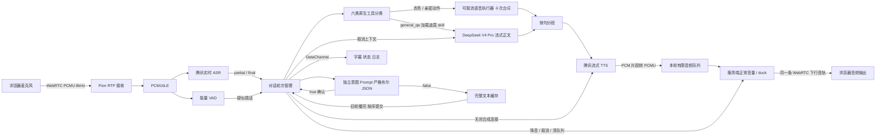
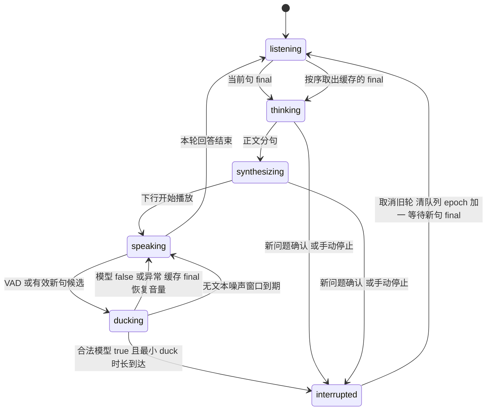

# 全双工语音打断实验 作业任务说明

本文件对应仓库中的《全双工语音打断实验（面试作业说明书）》。“已完成”的描述以当前代码和实际验证为依据；尚未完成的说明项保留标题，正文留空。后续代码修改需要同步维护本文件。

## 模块 A 场景选择与全双工方案分析

### 场景基本信息

当前场景是《洛克王国：世界》家园管理助手，固定扮演已经唤起的驻守精灵迪莫。用户可语音要求浇水、种菜、收菜、施肥，夸赞后触发亲密动作，也可通用问答。当前五类动作均用固定台词重复十次模拟执行，包括“贴贴”十次；未接真实游戏控制。

典型流程是“去浇水”启动长任务，播放中“别浇水了去施肥”确认打断并换成施肥；施肥中“迪莫你真棒”判为非打断，缓存到施肥结束后执行贴贴。玩家不用腾手按键，也不必等长任务结束才能改变任务，持续收音和语义打断因此有明确价值。官网/图鉴调研、用户场景事实边界和详细实现见 [场景调研与设计](场景调研与设计.md)。下文原有故事和数学联调作为媒体与打断模块的历史证据保留。

### 交互时序

浏览器取得麦克风权限后，持续通过 WebRTC 上行发送音频。腾讯 ASR 给出 final 后，DeepSeek V4 Pro 动作分类器返回六类之一的原生 function call；五个动作由语音执行器产出台词，通用问答加载迪莫 skill 流式生成。正文按句提交腾讯流式 TTS，收到音频片段后不断送入同一条 WebRTC 下行音轨。播放时麦克风和 ASR 不关闭。

用户说话后先触发服务端 50% duck，并把稳定 partial 或 final 交给独立的 DeepSeek 意图判定。true 实际执行打断时取消旧任务、清理待播和其他待处理文本、递增轮次并进入 `listening`；保留触发句，同句 final 到达后生成回答。false 的完整文本缓存，当前回答播完后按顺序自动作为后续问题提交；判定期间麦克风、ASR 和原播报继续工作。

### 角色、分类器与工具实现

[迪莫 SKILL.md](../internal/home/skills/dimo/SKILL.md) 以 `go:embed` 加载，固定问答中的伙伴身份、中文短句语气和能力边界。六类动作分类使用独立分类指令，不混入口语角色指令；调用 DeepSeek 原生 `tools` / `tool_choice:required`，服务端验证单一白名单 function call、空参数对象和完整结束标记；额外正文、拒绝、未知工具、多个调用或无效参数不执行。

官方 DeepSeek 地址的动作分类请求单独走 `/beta/chat/completions`，所有函数设置 `strict:true`，参数 schema 为不允许额外字段的空对象，约束生成端的工具参数。问答与打断判定维持原接口；自定义网关保持原路径，不推断其支持 Beta。供应商 strict 模式不替代本地的正文、单工具、白名单和完整性校验。

格式错误可在同一 5 秒总期限内重试一次，未验证结果不触发工具执行；拒绝、网络/供应商错误和超时不做格式重试。最终失败时固定语音说明“这次任务没能启动”，不误说成用户表达不明确。`action_retry`、`action_result` 和日志记录重试、fallback 及细分校验原因。DeepSeek 的 `required` 只约束一个或多个工具，不能替代本地单工具校验，协议依据与调查细节见 [场景调研与设计](场景调研与设计.md)。

[home.Executor](../internal/home/home.go) 接收轮次上下文、调用 ID 和原始请求，默认 `VoiceExecutor` 产生十次台词。它和 LLM 共享同一分句、腾讯 TTS、背压队列和取消机制。`tool_status:completed` 等待音频队列发送完才触发；执行器产出台词完毕不意味着缓存可以提前派发。未来可通过 `NewWithExecutor` 接入真实游戏 adapter，本阶段没有游戏写操作。

### 全双工定义

WebRTC 媒体传输是双向同时工作的；对话体验属于近全双工。播放期间上行采集和识别一直运行，但语音断句、云服务处理和浏览器缓冲仍有延迟。浏览器请求回声消除，服务端目前使用能量 VAD，没有独立的声学回声消除器，因此不能承诺外放环境下完全无误打断。

### 技术选型及理由

Go 和 Pion WebRTC 提供服务端媒体链路，自定义 offer/answer 简化本地演示部署。PCMU/8kHz 可由浏览器和 Pion 直接协商，Go 侧可直接解码成腾讯 ASR 所需的 PCM16；腾讯流式 TTS 同样选择 8kHz PCM，避免本阶段引入重采样。

ASR 采用腾讯实时 WebSocket `8k_zh`；LLM 按用户选择使用 `deepseek-v4-pro` 非思考模式，避免播报推理内容；TTS 采用腾讯 `TextToStreamAudioWS`。使用已有云模型，把工作重点放在双向媒体、轮次隔离、取消和打断验证。DataChannel 用于字幕、状态、指标和停止命令。

### 角色音色方案

按用户确认的“先用接近迪莫感觉的童声”，默认音色改为腾讯 `603002`（软萌心心，超自然大模型特色男童声）。[官方音色列表](https://cloud.tencent.com/document/product/1073/92668)未提供名为迪莫的公开音色，因此此处是角色近似配音，未做原声复刻。身份和台词由角色 skill / 工具决定，实际发声由 `TENCENT_TTS_VOICE_TYPE` 指定，角色 prompt 本身不会改变音色。

该音色支持 8kHz，通过现有[实时合成接口](https://cloud.tencent.com/document/product/1073/94308)直接返回 PCM16LE，继续转 PCMU；不通过修改采样率来抬高音调。语速与音量保留默认值，仍由统一下行队列执行 50% duck、取消和清缓存。

2026-09-12 使用 `go run ./cmd/tts-preview -voice 603002 -out bin/voice-soft-child.wav` 真实调用相同流式客户端，收到 13 个音频分片，首包 930ms，音频 5839ms，PCMU 解码后 RMS 3265，正常收到 final。对照音色 `101015`（智萌）也成功合成。本次首包数据为单次网络实测，不是延迟承诺；本地 WAV 供试听，不作为耳机听感或原声相似度的自动验收。

更换音色后的[真实 WebRTC 回归记录](evidence/child-voice.json)验证了种菜期间问题缓存、施肥指令确认打断并丢弃旧问题、施肥十次结束后回答新问题。浏览器接收 1476 个 RTP 包，累计音频能量 2.2230；虚拟麦克风及物理输出静音的验证边界同下文。`go test ./...` 和 `go vet ./...` 均通过。

### 链路简图



## 模块 B WebRTC 全双工媒体链路

### 建连方式及信令步骤

使用非 Trickle ICE 的自定义 SDP。浏览器建立 `RTCPeerConnection`，添加麦克风音轨和 `control` DataChannel，创建 offer，等 ICE 收集结束后调用 `POST /api/offer`。Go 服务端创建 Pion 会话、设置远端 offer、生成 answer，返回 SDP；浏览器设置远端 answer 后完成连接。

当前单进程维护一个浏览器会话，新连接会关闭旧连接。未做公网 TURN 部署或完整弱网优化，符合本地实验范围。

### 上行音频

浏览器 `getUserMedia` 请求回声消除、降噪和自动增益。媒体协商选择 PCMU/8kHz/mono，Pion 读取 RTP 后解码为 PCM16LE。全部音频，包括静音和 AI 播放期间的输入，送入独立的有限 ASR 队列，按 3200 字节/200ms 发送至腾讯实时识别接口；VAD 使用同一份解码音频。

### 下行音频

服务端创建一条长存的 PCMU 音轨，不为每轮回答重新建连接。DeepSeek 正文按句分段，每段最多 100 个字符；腾讯 `stream_ws` 返回的 PCM16LE 二进制片段随到随转为 PCMU。分片边界不足一个 PCM 样本或一个 160 字节 RTP 帧时保留余量，直到后续片段补齐，仅在句子结束时补齐最后一帧。

待播队列最多 250 帧，约 5 秒。RTP 时钟每 20ms 取出一帧；没有音频时发送静音保持媒体链路。duck 在服务端把 PCM 样本乘以 0.5 后重新编码，音频队列继续消费，不调用浏览器 `pause()`。

### 全双工证据

2026-09-12 使用 Chrome 虚拟麦克风和真实云接口完成联调。输入来自预先用腾讯合成的固定语音，经过浏览器 MediaStream、真实 WebRTC 上行和腾讯 ASR；没有注入识别结果或替换打断控制器。自动化将物理输出静音，以下音频能量来自浏览器 WebRTC 接收统计，不能替代物理麦克风和耳机验收。

同一连接的统计见 [barge-in.json](evidence/barge-in.json) 的 `media`：

| 采样时刻（UTC） | 阶段 | 上行累计 RTP 包 | 下行累计 RTP 包 | 下行累计音频能量 | 麦克风 live 且 enabled |
| --- | --- | ---: | ---: | ---: | --- |
| 05:17:55.300 | AI 正常播放 | 252 | 253 | 0.01113879 | 是 |
| 05:17:55.881 | duck 中 | 289 | 282 | 0.01672757 | 是 |
| 05:17:56.239 | 仍在 duck | 307 | 300 | 0.01681030 | 是 |

后两次采样都早于 05:17:56.797 的恢复事件；其间上下行包数和下行能量均增加，说明播放期间上行仍活着，duck 期间下行保留了声音。不同语音片段的累计能量不直接用来推算增益。

这份历史云联调记录使用 20% 增益。2026-09-12 随后根据用户听感反馈将增益调到 50%，避免未确认时旧播报过轻；当前 PCM 样本 RMS 比例单元测试验证约 50% 增益、队列继续消费和恢复原音量。原始云联调记录保留原值，不作为 50% 设置的重新实测结果。

### 降级与模拟边界

正式演示链路使用真实腾讯 ASR、DeepSeek 和腾讯流式 TTS。单元测试使用协议模拟服务验证异常和取消；这些测试不作为真实打断演示的替代。

浏览器自动化可以使用预合成的测试语音作为虚拟麦克风输入，输入随后经过实际 WebRTC 上行、真实 ASR、实际轮次管理、真实生成/合成和 WebRTC 下行。需在过程记录中注明该输入来源。原 `TextToVoice` 整句合成方法只保留供生成固定测试素材，不作为运行中的 TTS 回退路径。

## 模块 C 语音打断实现

### 打断触发源及选择理由

VAD 在 PCMU 解码后的 PCM 上计算 RMS，阈值为 700，连续约 200ms 超过阈值触发疑似插话。这一判断不依赖云端文字返回，可较快降低旧播报音量。较轻声音没有触发 VAD 时，另一句有效 ASR partial/final 也可以进入候选阶段。

### 疑似插话规则

状态变为 `ducking`，服务端样本增益降到 50%，约 -6dB。旧轮 LLM/TTS 保持工作，队列继续按序播放，RTP 不改成整段静音。如果没有得到确认，VAD 检测到约 500ms 静音后再等待 800ms，然后恢复原音量；连续噪声最多保持 duck 4 秒。重复开始事件不无限延长窗口。

### 确认条件及阈值理由

当前采用独立 LLM 语义判定，prompt 位于 [interruption.md](../internal/llm/prompts/interruption.md)，通过 `go:embed` 编入程序。LLM 复用 DeepSeek V4 Pro 的配置，但判定调用与正文生成请求相互独立。判断输入包含上一问题、当前已生成的回答、当前工具 `current_tool`、最新 ASR 文本和是否 final；输入被 JSON 编码为数据，prompt 要求忽略其中改变判定任务或输出格式的指令。

以下规则决定何时请求模型，不再直接决定硬打断：同一句至少两个字符的 partial 共同前缀稳定 200ms，或出现明确停止短语时可提前请求；有效 final 不受两字门槛限制，单字“停”“嗯”也可交给模型。标点和空白只用于去重及稳定性比较，判定收到保留句意的原始文本。

同一句最多 3 次 partial 请求，两次发起至少间隔 500ms，避免每个 token 都调用模型。final 补齐完整语义，不受 partial 限流影响；final 到达、ASR 改写或追加新文字时，会取消过时请求。已获 true 但尚在最小 duck 窗口的确认也会被更新文本撤回；只有已经实际硬切换轮次后，同句 final 才仅用于补齐问题。

等待类表达单独处理确认时机：partial 出现“等”“等一下”“等会”“稍后”等时，本句直到 final 才请求判定，日志记录 `waiting_final/ambiguous_wait`。例如“等一下再去种地”是后续任务，最终模型 false 后缓存；“等一下”单独说完是暂停，模型 true 后取消。这样避免模型只听到前半句“等一下”就停止当前浇水。规则仅延迟判定，最终语义仍由模型决定；“停一下”“别浇水了”等明确停止可继续走 partial 快速判定。

模型的唯一合法输出为 `{"interrupt":true}` 或 `{"interrupt":false}`。请求启用 JSON mode、非思考模式、温度 0 和最多 32 个输出 token；本地解析还会拒绝额外字段、重复键、字符串布尔值、null、大写 True/False、解释文字、代码围栏及截断结果。仅合法 true 可以硬确认，没有关键词旁路。

prompt 按目标状态判定：直接请求与当前不同的农务动作默认 true，例如种菜过程中说“去施肥”，无需“别种菜了”；明确“稍后/做完再去”则 false，明确取消当前活动优先。同类动作（含种菜/种地等同义词）、夸赞、亲密请求及普通问题均不默认打断；要转入通用问答需明确停止、暂停或优先回答，例如“先别种菜了，回答我...”或“先回答我的问题”。从问答或亲密动作转入明确农务也 true。它不含声纹或声学说话对象识别，语义判断仍可能出错。旧轮已经播放时至少经历 120ms duck 再取消；尚未开始播放时可直接取消生成。

“立即改变动作”指在合法 true 后不等旧动作完成，仍保留两阶段闭环；完整稳定 partial 可先确认并取消，随后等待同句 final 启动新工具。上述语义由独立 prompt 固定，不用命令关键词绕过 LLM 协议校验。专项 [home-switch-classifier.json](evidence/home-switch-classifier.json) 包含 6 个动作分类和 33 个打断对照；农务交叉切换、延后任务、问答边界和 partial 完整度均通过。

[真实语音专项](evidence/home-switch-voice.json) 已验证种菜过程中直接说“去施肥”：判 true 后取消旧任务及活动 TTS，清掉 250 帧待播，再在新轮施肥。随后普通问题判 false，等施肥十次完成后才回答。测试输入为腾讯合成的虚拟麦克风语音；判定耗时与事件顺序见证据文件，不当作物理耳机延迟。

### false 缓存与异常规则

false 恢复原音量，完整 final 进入按首次识别顺序排列的缓存。同句 partial 仅更新草稿，不能提前当成完整问题回答；partial false 后 final 会再次判定。当前生成结束且音频队列全部发送后，自动将第一条完整缓存输入提交为新问题，随后依次处理后续输入。这里“播完”是服务端发送边界，不是耳机实际播放结束回调。

缓存最多 8 句，每句最多 2000 字符；队列满会显示“本句未收录”，不静默覆盖旧输入。缺失 final 的草稿连续 15 秒没有更新时释放，ASR 结束也会释放未确认草稿，避免挡住后续完整文本。重复 final 去重；手动停止、断开和语音确认打断都会清空待处理输入。语音打断先取出触发切换的这句话，再作废其他完整缓存/草稿、取消其意图请求并将句子 ID 记入去重集合，最后取消旧轮和建立新轮；触发句的 final 可以正常补齐新指令，已丢弃句的迟到 final/模型结果无法复活。

清空与实际执行打断在同一把锁内完成，不在疑似插话或仅获得尚可撤回的 true 时提前清空；false、判定失败和确认被撤回均保留缓存。清理通过 `input_queue` 零计数同步前端，日志 `cleared=true reason=interrupted inputs_dropped=N` 记录被清掉的其他输入数（含草稿）。打断完成后收到的新输入仍正常缓存。测试覆盖 partial/final 两种触发、旧缓存与草稿清理、迟到结果、触发句保留、撤回确认不清空以及新轮继续接收输入。

[真实语音清缓存回归](evidence/home-clear-buffer-voice.json) 已验证：种菜时缓存一个问题，再用“去施肥”打断，旧问题不再派发；施肥期间新提出的问题仍在施肥完成后回答。队列归零、丢弃句子 ID、新问题派发及工具顺序均保存在证据中。复现使用 `go run ./cmd/demo-fixtures -scene home-switch` 和 `node scripts/verify_home.cjs --clear-buffer`。

每个判定请求最长 2 秒。超时、网络错误和非法 JSON 均显式兜底为 `interrupt=false`，保留旧播报并缓存 final。兜底通过 `fallback=true` 和错误原因标明来源，与模型正常返回的 false 区分。原轮次已经播完时，不再等待其判定结果，直接按序处理完整输入；请求绑定原轮次及版本，迟到的 true 不能取消后续回答。

例如模型返回 `好的，{"interrupt":false}`，严格解析先拒绝该输出，随后业务层作出 false 兜底。服务端日志格式示例（非实测时间线）：

```text
intent epoch=1 interrupt=false fallback=true reason=invalid_output latency_ms=500 error="intent result must be exactly one JSON boolean field: interrupt"
```

失败原因分别为 `invalid_output`、`timeout`、`request_failed`；模型正常判为 false 时日志标记 `fallback=false`。不会在日志中打印原始模型输出或凭证。

false 表示延后处理，不是忽略。普通“嗯”“继续讲”等完整转写也会在播完后作为输入提交，可能产生额外回复；这是当前按用户要求统一缓存的行为。

### 取消范围

硬确认在 Go 轮次管理器内执行：取消旧轮上下文，从而结束仍在运行的 LLM HTTP 流、TTS WebSocket 和旧轮意图请求；清空待播帧和当前待重试帧；让旧轮退出活动状态。每次入队还会检查当前轮次，晚到片段不能再次加入待播。下行在新回答到来前发静音。

浏览器维持同一音轨播放，不以页面静音或 `pause()` 实现打断。已经送到浏览器缓冲区的旧音频无法由服务端撤回，仍可能存在少量尾音，这是目前的边界。

### 轮次管理

`response_epoch` 在确认打断时立即递增，创建绑定新 `utterance_id` 的等待轮次，状态为 `listening`。收到同一句的 final 后，在这个轮次内启动回答，不再次递增。被取消的句子 ID 会记入去重集合，旧 partial/final 不能复活旧回答。

若模型确认时 final 已经到达，则直接用已保存的完整文本启动新轮回答，不再等待一次 final。模型判断增加了延迟，不保证每次都能在 ASR final 之前完成确认。

日志记录 `response_cancelled` 和 `turn_transition`。取消记录包含当时 LLM/TTS 是否仍活动、清理帧数；流结束日志包含取消状态。停止按钮携带目标 `response_epoch`，旧命令不能停止新轮。

另有 `intent_status`、`intent_result`、`input_buffered`、`input_queue` 和 `input_dispatched` 事件，关联轮次及句子 ID。`intent_result` 记录布尔值和请求耗时，错误时明确包含 `interrupt:false`、`fallback:true`、`status:"error"` 及失败原因。final 原始接收时间保留在缓存中，final 到首字/首音频指标包含判定和主动排队的时间。

### 误触发处理

对只有噪声能量而无有效 ASR 文本的输入，先 duck，确认窗口过后恢复。不稳定的 partial 不立即请求模型，纯语气词、否定和引用停止词由意图 prompt 判断。ASR 失败时解除未确认的 duck，避免一直低音量播放。

prompt 会参考当前回答避免把明显回读当成新指令，但尚未做确定性的字幕相似度比较，也未做服务端回声消除。噪声若被转写成真实停止请求仍可能误确认，文本模型不能替代声学语音鉴别。

### 状态机



`ready/completed` 对应空闲监听，`listening` 对应已经分配新轮次但还在等待 final；`failed` 为云服务或超时错误。连接关闭会取消所有活动任务。

### 完整打断闭环演示结果

家园场景真实联调见 [home-voice.json](evidence/home-voice.json)。浇水轮次 2 收到合法 true 后取消并清除 250 帧，施肥轮次 3 连续输出十次；夸赞判 false 后缓存，施肥轮次完成后才启动轮次 4 并输出十次“贴贴”。浏览器收到非零下行音频能量且持续发送上行 RTP；物理音频输出静音。此项验证的是语音模拟工具的完整闭环，不是游戏执行回执。

这次 ASR 将第一句拆成“迪墨。”和“你去浇下水。”，轮次 1 因此先回应“我在呢，小洛克。有什么可以帮忙的吗？”，浇水请求缓存后才启动。没有隐藏该额外轮次，也没有实现名字唤醒或跨 final 合并。

当前语义版真实联调见 [intent-barge-in.json](evidence/intent-barge-in.json)，包含明确插话 true 和“你先继续讲，讲完再告诉我一加一等于几”false 两条路径。false 路径保持旧轮完成后再处理缓存；true 路径在模型结果到达后才取消旧轮、清队列并完成新回答。输入是腾讯预合成语音的虚拟麦克风，ASR、意图 LLM、回答 LLM、TTS 和 WebRTC 都真实运行。

以下保留早期文本规则版本的历史证据，不能当作当前模型判定性能：真实联调通过“正常播放 → 噪声 duck 后恢复 → 明确插话 → 后端取消及清队列 → 新轮等待 final → 新回答播放”。原轮次 1 的 250 帧待播音频被清掉，约相当于 5 秒音频；确认时 TTS 仍活动，服务端记录其因取消而退出。当时 LLM 已生成完，记录为 `llm_active=false`，不把该次记录当成取消活动 LLM 的证据。LLM 与 TTS 同时活动时的取消由 `TestConfirmedInterruptionCancelsActiveLLMAndStreamingTTS` 验证。

新轮次 2 在对应 final 之前约 988ms 建立。腾讯 ASR 将输入拆成“等一下，不讲故事了”和“请告诉我1+1等于几”两句，因此第 2 轮又被后一段识别取消，第 3 轮最终回答“1+1等于2”。第 1 轮没有再出现 `speaking/completed`；单元测试同时验证迟到音频入队被拒绝、下一帧不发送旧轮音频。

这证明了服务端控制和真实媒体主路径。浏览器已缓存的旧音频尾音未做物理录音测量，不能据此声称耳机输出零残留。

## 模块 D 效果测试与对比分析

### 测试集

新增家园分类测试使用 12 个真实 DeepSeek 动作样例和 4 个打断样例，结果全部符合预期，见 [home-classifier.json](evidence/home-classifier.json)。动作覆盖四类农务、夸赞、知识问答、否定、询问方法、复合指令、拒绝亲密、不支持的驱逐和引用命令；打断覆盖立即替换、夸赞延后、做完再做和否定停止。工具白名单、拒绝、异常澄清、取消分类请求及迟到结果隔离由本地测试覆盖。

早期规则版云联调使用以下三个输入，输入脚本见 [verify_barge_in.cjs](../scripts/verify_barge_in.cjs)：

| 输入 | 时机 | 观测结果 |
| --- | --- | --- |
| 请给我讲一个小故事。 | 连接且 ASR 就绪后 | 得到生成文本和下行语音 |
| 固定种子生成的 320ms 宽带噪声 | AI 已在播放时 | duck，无有效转写，恢复原轮音量 |
| 等一下，不讲故事了，请告诉我一加一等于几。 | 恢复后 AI 仍播放时 | 确认打断、清旧队列、分配新轮，最终回答 2 |

纯语气词、不稳定 partial、final 单独触发、持续噪声、手动停止和断开已在可控单元测试覆盖；这些不计作真实云语音样本。真实设备上的扩展测试单独留在未完成项。

语义版另以真实 DeepSeek 测试了 6 个文本样例：明确停止、继续且否定停止、讲完再回答、引用停止词、纠正当前回答、单字“嗯”。合法 JSON 和预期分类均通过，原始输入/结果/耗时见 [intent-classifier.json](evidence/intent-classifier.json)。真实语音脚本 [verify_intent.cjs](../scripts/verify_intent.cjs) 则覆盖 true 硬取消和 false 缓存后继续回答。

### 对比方式

### 评价维度

目前记录是否先降音、降音时下行是否仍含音频、上行是否继续、无文本噪声是否恢复、取消时待播清理量、新轮是否先于 final 建立、旧轮是否再次进入播放、新问题能否完成回答。服务端同时记录句末到首字、句末到首音频发送、插话到首个非零降音帧发送的延迟。尚未将单次通过率当作误打断率或漏打断率统计。

### 定量记录

2026-09-12 家园场景的 12 次原生动作分类耗时 504–1027ms，4 个家园打断文本样例均在 2 秒期限内返回预期值。真实语音链路中浇水的 final 打断判定为 true，耗时 653ms；施肥时夸赞判 false，耗时 1001ms。此处是小样本功能联调数据，不作为准确率或分位数统计。

当前独立语义判定的 6 个真实 API 样例耗时分别为 743、1154、415、853、454、820ms，均在 2 秒上限内。样本量有限，不据此推算准确率或 P50/P95。

以下为早期规则版同一次联调的服务端估算指标，原始值见 `response_metrics`；不是当前意图模型的延迟、P50/P95 或用户实际听感时延。

| 观测项 | 本次值 | 测量边界 |
| --- | ---: | --- |
| 噪声疑似插话到降音 | 210ms | VAD 回推起点至首个非零降音 RTP 帧发送 |
| 明确插话到降音 | 610ms | 同上；若输出处于句间静音，会等到下一非零帧才记值 |
| 明确插话 duck 状态到确认事件 | 约 955ms | 浏览器收到状态与取消事件的时间差 |
| 第 2 轮提前于对应 final 建立 | 约 988ms | 浏览器收到 `turn_transition` 到同句 `asr_final` |
| 第 1 轮清理的待播 | 250 帧 | 后端队列计数，20ms/帧 |
| 最终问题句末到首字 | 1017ms | ASR 句末偏移映射到服务端收音时钟，再到 LLM 正文 |
| 最终问题句末到首音频发送 | 1869ms | 同一句末估算点至非静音 RTP 帧发送 |
| 最终问题 final 到首字 / 首音频发送 | 754ms / 1606ms | final 进入轮次管理器至上述输出点 |

句末估算不包含麦克风采集和上行网络延迟，发送点也不包含浏览器抖动缓冲、系统输出和耳机延迟。数据缺失时显示 `--`。一次噪声恢复和一次问题切换不足以形成稳定效果统计。

### 失败案例与反思

1. 单频测试音误转写：早期调试中用 1000Hz 测试音代替噪声时，ASR 曾输出有效文字，造成确认打断。该调试样本没有纳入 JSON。能量 VAD 只判断声音强弱，稳定文字也不必然来自真实插话。当前增加了意图判断，但没有重新录制这类声学样本验证抑制率；仍应收集真实咳嗽、回声和环境噪声，对比专用语音 VAD，并评估下行参考音频或转写相似度；相似度过滤也可能误伤用户复述。
2. 复合插话被拆成两句：早期 ASR 在“不讲故事了”后输出 final，系统为它生成回复，后续“一加一”又切换轮次。语义版也可能把“继续讲”和“讲完再问”分成独立 final，false 队列会逐条提交，产生额外回答。当前没有实现跨 final 合并，保留原始事件。后续可评估短时间合并或对纯附和不生成回答，同时测量额外等待并确认产品规则。
3. 等待安排误当暂停：用户报告“去浇水”后说“等一下再去种地”，浇水被取消。2026-09-12 15:04:08 本机日志确认取消发生在 final 之前；日志当时没有记录识别原文，不能复原该次模型收到的确切 partial。旧 prompt 将 wait request 列为 true，且补长文本未使同前缀旧请求失效。现已区分未来动作与当前停止、等待类 partial 延至 final、补长文本作废旧请求，并记录请求阶段。本地回归覆盖误判 true 的保护和待实施确认撤回；真实模型专项 [home-wait-classifier.json](evidence/home-wait-classifier.json) 的 4 个动作及 9 个语义对照均通过。

该问题的真实语音回归见 [home-wait-voice.json](evidence/home-wait-voice.json)：ASR 完整收到“等一下再去种地。”，判定 false 后缓存；浇水十次完成后才种菜十次，无旧轮取消。UTC 07:12:11.967 判 false，07:12:24.449 浇水完成，07:12:25.096 种菜开始。复现命令为 `go run ./cmd/demo-fixtures -scene home-wait` 和 `node scripts/verify_home.cjs --wait`。长停顿导致 ASR 分成两个 final 的情况仍属于未实现的跨句合并范围。

4. 常见换任务指令触发协议兜底：“先别浇水了，去施肥。”的截图对应 15:18:51 动作分类 `invalid_output`（878ms），前一步打断为 true 且取消成功。旧日志不足以还原具体格式问题；修正前 12 次真实调用未复现该偶发错误，不能认定某个字段是原因。现已把分类指令与口语角色分开，格式异常限重试一次并维持严格执行校验，增加细分日志，最终技术失败不再提示“没确认你想做什么”。额外正文、多调用、非法参数及截断的重试恢复、拒绝不重试、只执行一次、总期限和取消由本地测试验证。修正后的多上下文分类样例见 [home-replacement-classifier.json](evidence/home-replacement-classifier.json)。

真实语音专项 [home-replacement-voice.json](evidence/home-replacement-voice.json) 已验证截图原句：UTC 07:29:30.218 浇水取消，07:29:31.748 施肥开始，07:29:48.098 十次施肥完成，之后夸赞延后执行贴贴十次。该次没有格式失败或重试；回归输入是腾讯合成的虚拟麦克风语音，物理音频静音，不能当作原始故障响应复现。

5. 第一次夸赞提示“任务没能启动”：15:37:36 夸赞判 false，15:37:44 种地完成后派发缓存；15:37:45/46 两次动作分类均为 `nonempty_arguments`，触发技术失败提示。不是缓存丢失，也不能归因于 ASR 把“得”写成“的”。使用公开场景文本和构造历史真实调用，普通模式复现 `affection` 的 arguments 为 `{"additionalProperties":{}}`；同样输入的 strict 模式返回 `{}`。原始响应未保存，这份新响应是同类错误的复现。现启用上述官方 strict 模式，并保留本地拒绝无效参数和限次重试；[夸赞分类证据](evidence/home-praise-classifier.json) 包含 12 个分类及 2 个打断样例，[六工具回归](evidence/home-strict-classifier.json) 覆盖所有动作类别。

首次夸赞的 [真实语音回归](evidence/home-praise-voice.json) 只输入一次“干得不错”，先缓存，等种地十次完成后再贴贴十次，无分类重试或失败提示。回归使用腾讯合成的虚拟麦克风语音，物理输出静音；源码复现命令见 [场景调研与设计](场景调研与设计.md)。

### 家园风格前端呈现

保留连接/断开、麦克风 RMS 和波形、远端音频播放器、实时字幕、语音回答、轮次、工具与插话状态、待回答计数、停止回答、三项延迟观测及日志。页面采用单一工作台结构，桌面将字幕与回答并排，手机纵向排列；长文本和日志可滚动，长状态/错误提示自然换行，控件 ID 与事件协议保持一致。

背景使用官网公开原野场景，配以迪莫贴纸、绿色边框、蓝色状态和浅红停止按钮。图片裁剪后转换为 WebP，图标使用 Lucide，本地资源及来源说明见 [SOURCES.md](../web/assets/SOURCES.md)。这些是主题素材，不代表接入游戏或已经核实家园实景。波形改为浅色网格和绿色曲线，空闲/断开也绘制底图；角色轻微动画尊重 `prefers-reduced-motion`。

[verify_ui.cjs](../scripts/verify_ui.cjs) 已验证 1440、1024、768、390、320px 的资产加载、21 个原有控件、初始按钮状态、canvas 非空像素、长文本/错误排版和减少动画设置，无横向溢出及内容重叠。该布局脚本使用构造的展示状态。新 UI 的 [真实语音回归](evidence/home-ui-voice.json) 另通过腾讯合成虚拟麦克风验证种菜、缓存问题、切换施肥并丢弃旧缓存、缓存新问题及播完再答，物理音频静音；[桌面截图](evidence/home-ui-desktop.png) 与 [手机截图](evidence/home-ui-mobile.png) 来自这次真实链路。

## 交付与复现

### 运行方式

需要 Go 1.22 或更高版本、支持 WebRTC 的浏览器。在根目录 `.env` 配置腾讯 AppID、SecretId、SecretKey，以及 DeepSeek API Key 和 URL，字段见 `.env.example`。默认模型 `deepseek-v4-pro`，腾讯童声音色 `603002`（软萌心心）。

```powershell
E:\go\bin\go.exe run ./cmd/server
```

打开 `http://localhost:8080`，连接麦克风。远程访问时需要 HTTPS；localhost 可直接申请麦克风权限。密钥仅由 Go 服务端使用，`.env` 不提交到 Git。

### 演示步骤

1. 在服务端配置并开通真实腾讯 ASR/TTS、DeepSeek，启动服务；浏览器打开 `http://localhost:8080`，连接麦克风。
2. 说“请给我讲一个小故事”，等待字幕、回答文本和语音下行。
3. AI 播放时说“等一下，不讲故事了，请告诉我一加一等于几”。观察状态先变为“已降低音量，确认插话中”，随后轮次增加并显示“等待新问题说完”，最终出现新回答。
4. 检查日志中的 `response_cancelled`、`turn_transition` 和对应 final 顺序。误触发恢复可以用下述自动化脚本的固定噪声复现。

可复现自动化需要 Node.js、Chrome、Playwright，固定输入会调用腾讯 REST 合成，联调也会实际调用云接口。另一个终端保持服务运行，在项目根目录执行：

```powershell
E:\go\bin\go.exe run ./cmd/demo-fixtures
npm install --prefix bin/browser-check --no-save playwright
$env:NODE_PATH = (Resolve-Path 'bin/browser-check/node_modules').Path
E:\go\bin\go.exe run ./cmd/verify-intent
node scripts/verify_intent.cjs
```

默认 Chrome 路径为 `C:/Program Files/Google/Chrome/Application/chrome.exe`，可通过 `CHROME_PATH` 指定；默认服务地址为 `http://localhost:8080`，可通过 `DEMO_URL` 指定。脚本成功后更新浏览器事件 JSON，并在 `bin/` 保存桌面、手机宽度截图。测试会建立新会话，当前单会话服务会关闭先前的浏览器连接。

新脚本写入 `docs/evidence/intent-barge-in.json`；早期噪声及媒体证据脚本 `scripts/verify_barge_in.cjs` 保留。人工验证 false 路径时，可在 AI 播报中说“你先继续讲，讲完再告诉我一加一等于几”，观察“待回答”数量增加、原轮继续完成，再开始回答缓存输入。

本次桌面 1280px 和手机 390px 宽度截图已检查，无横向溢出，轮次和降音状态可见。Go 测试与静态检查命令：

```powershell
E:\go\bin\go.exe test ./...
E:\go\bin\go.exe vet ./...
```

本机未启用 CGO，未运行 race 检测；具备 C 编译器的环境可另行启用 CGO 后执行 `go test -race ./internal/dialogue ./internal/llm ./internal/tts ./internal/rtc`。

### 带时间戳的打断记录

家园版原始记录：[home-voice.json](evidence/home-voice.json)。2026-09-12 UTC 时间线：

| 时刻 | 轮次 | 事件 |
| --- | ---: | --- |
| 06:55:51.139 | 2 | `water` 开始语音模拟 |
| 06:55:54.211 | 2 | 意图 true，取消浇水并清除 250 帧 |
| 06:55:54.731 | 3 | `fertilize` 开始 |
| 06:55:58.165 | 3 | 夸赞判 false，随后缓存 final |
| 06:56:11.076 | 3 | 施肥十次音频发送完毕，工具完成 |
| 06:56:11.847 | 4 | `affection` 开始 |
| 06:56:22.232 | 4 | “贴贴”十次音频发送完毕 |

当前意图版完整浏览器事件见 [intent-barge-in.json](evidence/intent-barge-in.json)，按 `scenarios` 区分 false 延后处理与 true 打断。可跟踪 `intent_result` 到 `response_cancelled` 的先后顺序，或 `input_buffered` 到旧轮 `completed` 再到新轮 `thinking` 的顺序。

2026-09-12 当前版本实测时间线（UTC）：

| 场景 | 时刻 | 事件 |
| --- | --- | --- |
| false | 06:14:43.442 | 第一条输入判为 false，446ms，进入缓存 |
| false | 06:14:45.841 | 第二条输入判为 false，854ms，进入缓存 |
| false | 06:14:56.308 | 原轮次 1 自然完成，没有被取消 |
| false | 06:14:56.309 | 取第一条缓存，轮次 2 开始生成 |
| false | 06:15:08.906 | 轮次 2 完成，取第二条缓存，轮次 3 开始生成 |
| false | 06:15:12.307 | 数学问题回答完成 |
| true | 06:15:20.010 | 模型 true 到达，耗时 470ms |
| true | 06:15:20.011 | 取消原轮次 1，清除 250 帧，TTS 当时仍活动 |
| true | 06:15:20.013 | 建立轮次 2，此时 final 已收到，随后开始生成 |
| true | 06:15:22.205 | 下一句模型 true 到达，耗时 855ms |
| true | 06:15:27.854 | 最终数学回答完成 |

该输入仍被 ASR 分成两句。false 场景按顺序处理两条缓存，属于当前逐句队列规则；并非一次只产生一个后续轮次。

历史规则版浏览器事件见 [barge-in.json](evidence/barge-in.json)，服务端取消日志见 [server-barge-in.txt](evidence/server-barge-in.txt)。浏览器使用 UTC；服务端日志为北京时间 UTC+8。下表均为 2026-09-12 UTC：

| 时刻 | 轮次 | 事件及含义 |
| --- | ---: | --- |
| 05:17:54.935 | 1 | 已记录首个非静音下行音频发送 |
| 05:17:55.484 | 1 | 噪声触发 `ducking` |
| 05:17:56.797 | 1 | `speaking reason=unconfirmed`，恢复音量 |
| 05:17:57.305 | 1 | 明确插话触发 `ducking` |
| 05:17:58.260 | 1 | partial 为“等一下不”，确认并取消，清队列 250 帧 |
| 05:17:58.262 | 2 | `turn_transition`，新轮 `listening` 等待 final |
| 05:17:59.250 | 2 | 同一 utterance 的 final 到达，进入 `thinking` |
| 05:18:00.066 | 2 | 下一句 partial 确认，取消第 2 轮 |
| 05:18:00.068 | 3 | 新轮先建立，等待下一句 final |
| 05:18:00.867 | 3 | “请告诉我1+1等于几？”final 到达 |
| 05:18:02.475 | 3 | 已记录首个非静音下行音频发送 |
| 05:18:03.994 | 3 | 新回答播放队列完成 |

服务端记录了第 1、2 轮的 `tts_finished cancelled=true`，对应实际关闭旧合成任务。浏览器事件不直接证明云端内部算力已停止或计费立即结束，取消范围指本地请求、连接、任务和队列。

### 代码索引

| 说明项 | 实现位置 |
| --- | --- |
| 游戏调研与场景规则 | [场景调研与设计](场景调研与设计.md) |
| 迪莫角色 skill 与工具执行接口 | [internal/home](../internal/home) |
| 动作分类与本地原生调用校验 | [action.go](../internal/llm/action.go) |
| 工具轮次生命周期 | [action.go](../internal/dialogue/action.go) |
| 家园真实语音闭环 | [verify_home.cjs](../scripts/verify_home.cjs) |
| 信令及媒体会话 | [internal/rtc](../internal/rtc) |
| 腾讯实时识别 | [internal/asr](../internal/asr) |
| 疑似插话、确认及恢复规则 | [interruption.go](../internal/dialogue/interruption.go) |
| 意图请求、版本隔离及文本缓存 | [intent.go](../internal/dialogue/intent.go) |
| 意图 Prompt 与严格 JSON 协议 | [interruption.md](../internal/llm/prompts/interruption.md)、[intent.go](../internal/llm/intent.go) |
| 轮次、取消、队列、增益和发送 | [manager.go](../internal/dialogue/manager.go) |
| 腾讯流式合成协议及取消 | [stream.go](../internal/tts/stream.go) |
| 打断和完整闭环测试 | [interruption_test.go](../internal/dialogue/interruption_test.go)、[manager_test.go](../internal/dialogue/manager_test.go) |
| 真实云浏览器联调 | [verify_barge_in.cjs](../scripts/verify_barge_in.cjs) |
| 意图 true/false 浏览器联调 | [verify_intent.cjs](../scripts/verify_intent.cjs) |

### 尚未完成的扩展说明

#### 真实耳机与外放回声对比

#### 多轮 P50 P95 延迟统计

#### 浏览器实际播放时钟测量

#### 游戏 SDK 与真实家园操作

#### 唤醒与驻派精灵动态切换

#### 复合任务规划与跨 final 合并
