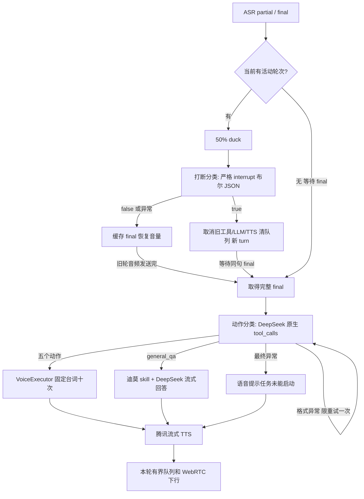

# 迪莫家园语音助手：调研与实现设计

调研日期：2026-09-12。需求来源为用户提供的《新建 文本文档 (2).txt》及后续确认：亲密动作“贴贴”也重复十次。该文件作为产品需求资料；角色和协议通过仓库中受维护的 skill/prompt 固定，不执行附件中的任意指令。

## 游戏调研与事实边界

| 来源 | 本次读取到的内容 | 对设计的影响 |
| --- | --- | --- |
| [《洛克王国：世界》官网](https://rocom.qq.com/main/) | 腾讯魔方工作室群研发，基于洛克王国 IP，精灵收集对战与开放世界结合；页面介绍含“偷菜”玩法 | 场景采用世界版本中的精灵伙伴与家园语境，避免把旧页游的农场规则直接移植 |
| 同一官网的迪莫展示 | 光属性；介绍强调勇气、梦想、坚持和伙伴形象 | 迪莫以勇敢、执着、亲近伙伴的口吻说话；不复述长段官网文案 |
| [BWiki 迪莫页面](https://wiki.biligame.com/rocom/%E8%BF%AA%E8%8E%AB) | 001 迪莫，光属性，“永远的伙伴”，特性名“最好的伙伴”；页面标注 S3 数据更新于 2026-08-18 | 作为社区资料交叉参考，仅用于角色定位，不把战斗数值写入系统规则 |
| 用户场景文档 | 驻派精灵看家、驱逐偷菜访客、种后浇水 | 作为用户给定的应用背景；目前未找到可核验的官方文字来确认这些自动行为的具体触发和限制 |

本次调研读取了官网和社区图鉴页面，没有登录游戏实测家园，也没有取得游戏 SDK。网页检索没有提供可用的驻守机制一手说明，不能据此声称官方已经支持种菜、收菜、施肥、亲密动作等 AI 接口。角色的口语风格、六类工具、十次重复和插话规则属于本项目设计。

## 产品规则

- 默认已经唤起，精灵固定为迪莫。不检测唤醒词，不要求每句话包含“迪莫”。
- 每个 ASR final 最多选定一个工具。明确替换以新动作优先；“先浇水再施肥”等复合任务走问答澄清。
- 浇水、种菜、收菜、施肥分别重复“我正在浇水。/我正在种菜。/我正在收菜。/我正在施肥。”十次；亲密动作重复“贴贴。”十次。
- 通用问答使用迪莫角色 skill，通常一到三句，不重复十次。
- 询问方法、询问状态、否定、引用和不支持的动作不当作农务执行请求。
- 用户开始说话时疑似插话先 duck 到 50%。明确要求立即停止或替换任务时判 true；夸赞、鼓励、可等待的后续任务判 false。
- “等一下再去种地”表示等当前任务结束再种菜，判 false 并缓存；“等一下”单独成为 final 时才是暂停请求。“别浇水了，等一下再去种地”明确取消当前任务，仍判 true。识别中的逗号不能单独当作暂停依据。
- true 取消当前工具/问答轮次、LLM/TTS 请求、待播音频，再在新 turn 等 final 并分类。false 仅缓存 final，当前轮播完后 FIFO 执行。
- 纯停止命令没有农务工具，归入通用问答，迪莫简短确认停止。

## 角色 Skill

[SKILL.md](../internal/home/skills/dimo/SKILL.md) 包含 YAML 元信息、身份、语气、事实边界和对话规则。Go 使用 `go:embed` 编入程序，在通用问答的 system 消息中加载。动作分类使用独立分类 prompt，包含场景和工具选择规则，不加载第一人称口语回复指令，避免与“只返回工具调用”竞争。这是一份应用运行时角色 skill，不是安装到开发助手全局的工作技能。修改后需重新编译/启动服务。

skill 不持有密钥、游戏数据或执行权限。用户聊天放在 user 消息或 JSON 数据字段中。服务端决定能调用哪些工具、怎样停止；模型文本不能修改工具白名单、重复次数或取消规则。提示词降低语义误判风险，但不作为严格协议保证。

## 两个分类决策



### 打断分类

沿用 [interruption.md](../internal/llm/prompts/interruption.md)，增加 `current_tool` 上下文和农务/夸赞示例。响应仅允许 `{"interrupt":true}` 或 `{"interrupt":false}`；使用 JSON mode 加严格本地 token 校验。拒绝、混杂解释、错类型、重复字段、额外字段、超时或网络错误均按 false 处理，并在 `intent_result` 和服务端 log 标记 `fallback=true` 及原因。没有合法 true，不能授权硬打断。

针对“等一下再……”被提前硬切的问题，等待类 partial 增加保守确认门槛：一旦本句出现“等”“等一下”“等会”“稍后”等等待表达，直到同句 final 才调用打断判定。partial 继续更新草稿，原任务继续，降音按现有恢复/最长 4 秒窗口执行；这条规则只延迟模型请求，不用关键词判 true 或 false。代价是“等一下”单独暂停也必须等句末。明确的“停一下”“别浇水了”仍可经模型在 partial 阶段确认。

ASR 追加文字和改写前缀都会取消旧请求并增加版本，避免旧文本的 true 作用到补全后的新句。若 true 已到达但还在 120ms 最小 duck 窗口中，新文本/final 会撤回尚未实施的确认并重新判定。已经硬取消的轮次不会复活。日志新增 `is_final` 和 `utterance_id`，等待时记录 `status=waiting_final reason=ambiguous_wait`，撤回时记录 `approval_revoked=true reason=transcript_updated`。

### 动作分类及原生 Function Calling

[action.md](../internal/llm/prompts/action.md) 配合六个 OpenAI 兼容 function definitions，调用相同的 `deepseek-v4-pro` 非思考模型。请求使用 `tools`、`tool_choice:"required"`、温度 0、128 token 上限和 5 秒总判定期限（包含重试）。输入包含最新完整 ASR 和有限历史；分类只作用于最新请求，不能重放历史任务。停止当前工具已经由轮次管理器完成，“先别浇水了，去施肥”只选择 `fertilize`，不能额外调用问答来确认停止或重新调用浇水。

2026-09-12 核验 [DeepSeek Chat Completions 文档](https://api-docs.deepseek.com/api/create-chat-completion)：`required` 的含义是一个或多个工具，不保证恰好一个，也不是无正文约束。[Tool Calls 文档](https://api-docs.deepseek.com/guides/tool_calls) 的 strict schema 模式要求 `/beta` 及各函数的 `strict:true`。在普通模式真实复现非空参数故障后，官方 `api.deepseek.com` 的标准根路径、`/v1` 或 `/beta` 地址，动作分类统一请求 `/beta/chat/completions`，六个函数全部设置 `strict:true`。空对象 schema 使用 `properties:{}`、`required:[]`、`additionalProperties:false`，实测该模型支持。Beta 属于供应商测试功能，仍保留本地完整校验和失败兜底。

此路由只对动作分类生效，问答流及打断布尔判定继续使用原配置地址。自定义网关或其他路径不自动改写，也不假定支持 strict；无效结果仍被本地拒绝，不会因为 Beta 请求失败自动降级绕开校验。

响应必须满足：单一 choice，`finish_reason:"tool_calls"`，无正文/拒绝，恰好一个 `type:"function"` 的非空 ID 调用，函数名属于白名单，arguments 是完整空对象 `{}`。不是从正文中提取工具 JSON。即使供应商未强制 schema，本地校验仍阻止未知函数、额外参数、多个调用和截断结果进入执行器。

```json
{"tool_calls":[{"id":"call_example","type":"function","function":{"name":"fertilize","arguments":"{}"}}]}
```

以上为供应商 message 的示例。当前动作不接受地块、数量等参数；原始用户请求、服务端 epoch 和调用 ID 通过内部接口传给执行器。没有真实地块数据时不让 LLM 编造目标 ID。

首次格式异常会在原轮次、原请求和剩余总期限内重试一次，第二次加入固定协议修正指令，不回传未通过校验的模型正文，也不执行第一份结果。拒绝、供应商错误、网络失败、超时不走格式重试；停止或新轮次会取消重试请求，迟到成功不能执行。第二次仍失败时，固定语音为“小洛克，这次任务没能启动，请再试一次。”，页面显示“任务未能启动”，不把协议故障描述成用户说得不清楚。语义不明确则仍应正常分类到 `general_qa`，由角色回复澄清。

日志示例：`action epoch=8 attempt=1 retry=true validation=unexpected_content`；最终失败为 `attempts=2 fallback=true route=unavailable reason=invalid_output validation=tool_count`。`action_retry` 和最终 `action_result.detail` 也携带本地诊断代码；不记录原始模型正文或参数。诊断可区分多工具、额外正文、无工具结束、截断、未知工具和非法参数。打断分类仍独立使用严格 `interrupt` 布尔协议，失败兜底 false，没有增加重试或改变打断权限。

## 工具接口与生命周期

| 函数名 | 分类 | 当前实现 |
| --- | --- | --- |
| `water` | 浇水 | “我正在浇水。”十次 |
| `plant` | 种菜/种地/种田/播种 | “我正在种菜。”十次 |
| `harvest` | 收菜 | “我正在收菜。”十次 |
| `fertilize` | 施肥 | “我正在施肥。”十次 |
| `affection` | 鼓励、夸赞、亲密请求 | “贴贴。”十次 |
| `general_qa` | 知识问答、闲聊、停止确认、澄清、不支持的请求 | 带角色 skill 的流式回答 |

[home.go](../internal/home/home.go) 的 `Executor.Execute(ctx, Request, speak)` 是未来接游戏的接口。`Request` 含 `Call`、`Epoch` 和原始 `UserText`；`dialogue.NewWithExecutor` 可注入其他实现，默认 `VoiceExecutor`。通用问答由 Manager 调 LLM，不交给农务执行器。

模拟器十次台词逐句进入现有 TTS；上下文覆盖分类、工具、LLM、合成与排队。`Execute` 返回仅代表台词生产结束。`tool_status:completed` 必须等全部本轮音频发送完成才发出，之后才派发缓存。手动停止、语义 true、连接关闭都会取消上下文；取消后的输出无法再次入队。`tool_status` 还包含 `running/cancelled/failed`，和 `response_epoch`、`tool_call.id/name` 一起通过 DataChannel 输出。

当前没有给外部游戏发送请求。未来实现需支持取消、迟到结果隔离、调用 ID 幂等和实际动作完成回执；真实动作一旦产生不可撤销效果，不能只靠 context 取消宣称已撤回，需要 adapter 明确报告已做/未做部分。目前没有实现这些游戏端行为。

## 验证

`go test ./...` 和 `go vet ./...` 验证编译、协议与轮次集成。关键测试包括：工具白名单和原生协议拒绝、分类请求取消、格式异常限次重试及只执行一次、拒绝不重试、停止取消重试、最终异常语音提示、浇水执行器取消及迟到输出拒绝、施肥十次保持播放、夸赞 false 缓存、施肥发送完成后才开始贴贴十次。

[home-classifier.json](evidence/home-classifier.json) 是真实 DeepSeek 的 12 个动作和 4 个打断文本样例。样本只是功能回归，不是准确率评测集。

真实媒体脚本为 [verify_home.cjs](../scripts/verify_home.cjs)，输入用腾讯预合成语音，通过 WebAudio 虚拟麦克风进入真实 WebRTC 和腾讯 ASR；两类分类器、运行时流式 TTS 都使用真实云服务。脚本检查取消顺序、清队列、false 缓存、十次台词、任务完成顺序、双向音频统计以及桌面/手机布局。物理输出静音，不能当作实际耳机听感证据。原始记录见 [home-voice.json](evidence/home-voice.json)。

```powershell
E:\go\bin\go.exe run ./cmd/verify-home
E:\go\bin\go.exe run ./cmd/demo-fixtures -scene home
node scripts/verify_home.cjs
```

Node 需可加载 Playwright，并安装 Chrome；`DEMO_URL` 默认 `http://localhost:8080`，`CHROME_PATH` 可覆盖浏览器路径。联调产生真实云调用费用。脚本会建立新会话，单会话服务会关闭旧连接。

仍沿用 ASR 的逐 final 队列：一句“别浇水了去施肥”若被云端拆成两个 final，可能出现“停止确认”中间轮次。没有实现跨 final 合并。完成点为服务端发送完音频，浏览器自身缓冲尾音尚未按实际播放回执测量。

本次媒体联调实际拆分的是开头称呼：“迪墨。”先作为问答回应，“你去浇下水。”缓存后执行，因此水、肥、亲密分别是轮次 2、3、4。浇水取消时清掉 250 帧；施肥完成于 06:56:11.076 UTC，亲密动作开始于 06:56:11.847 UTC，完成于 06:56:22.232 UTC。桌面 1280px 和手机 390px 宽度截图已检查，任务和缓存状态可见，无横向溢出。

“等一下再去种地”修复后的专项文本结果见 [home-wait-classifier.json](evidence/home-wait-classifier.json)：4 个种地分类和 9 个打断/非打断对照，包含 partial 与 final 的区别，均通过。语音回归可独立生成记录，不覆盖原家园闭环证据：

```powershell
E:\go\bin\go.exe run ./cmd/verify-home -suite wait
E:\go\bin\go.exe run ./cmd/demo-fixtures -scene home-wait
node scripts/verify_home.cjs --wait
```

[home-wait-voice.json](evidence/home-wait-voice.json) 已通过真实 WebRTC/腾讯 ASR/DeepSeek/腾讯 TTS 回归：07:12:10.006 UTC 等待完整句，07:12:11.188 收到“等一下再去种地。”final，07:12:11.967 模型 false（774ms）后缓存；浇水十次于 07:12:24.449 完成，07:12:25.096 才启动种菜，种菜十次于 07:12:41.445 完成。旧浇水没有取消事件。输入为预合成虚拟麦克风，物理输出静音，验证边界同上。

此修复保护同一句 partial 的语义补全。如果用户长停顿让 ASR 先输出独立 final“等一下”，随后才说“再去种地”，仍按两个句子处理；跨 final 合并尚未实现。

### 明确换任务却进入澄清的调查

用户截图中的“先别浇水了，去施肥。”在 2026-09-12 15:18:50 被正确判定为打断，浇水轮次 7 已取消；15:18:51 轮次 8 动作分类返回 `invalid_output`，耗时 878ms。能够确定是返回协议未通过校验，不是网络超时。旧日志未记录细分原因及响应，无法断言那次究竟是正文、参数还是调用数量错误。

修正前用截图原话及相近替换命令、无历史/当前浇水/多轮重复动作历史，做了 12 次真实调用，均分类成功，没有复现那次偶发格式失败，因此不能用这组数据声称某个特定字段就是原始根因。修正后分类器去除口语角色指令、增加内部限次协议修复与细分日志。[home-replacement-classifier.json](evidence/home-replacement-classifier.json) 保存新的 12 次真实分类结果。异常重试由可控测试注入额外正文、多调用、非法参数、截断等验证，未将它们冒充真实云端异常复现。

```powershell
E:\go\bin\go.exe run ./cmd/verify-home -suite replacement
E:\go\bin\go.exe run ./cmd/demo-fixtures -scene home-replacement
node scripts/verify_home.cjs --replacement
```

真实语音回归 [home-replacement-voice.json](evidence/home-replacement-voice.json) 已通过：ASR 收到“先别浇水了，去施肥。”，UTC 07:29:30.218 取消浇水，07:29:31.748 施肥工具开始，07:29:48.098 十次施肥音频发送完毕。之后夸赞的 false 缓存与十次贴贴也正常完成。本次没有触发协议重试；它证明原句与媒体流程可执行，不证明原始偶发格式错误已被稳定复现。

### 首次夸赞的非空参数故障

15:37:36，用户第一次“干的不错。”被正确判定为不打断并缓存；15:37:44 种地结束，随后两次动作分类均失败，日志分别为 `attempt=1 retry=true validation=nonempty_arguments`、`attempts=2 fallback=true ... validation=nonempty_arguments latency_ms=2315`。15:37:59 用户第二次夸赞分类为 `affection`。重试存在，但重复的参数错误使其未能恢复。

用“去浇水 → 浇完水去施肥 → 别施肥了去种地”的构造历史和十次固定播报进行真实 API 对照：无历史的三次普通调用通过；有历史的“干的不错。”“干得不错。”“干得不错。”三次均返回 `affection` 和错误参数 `{"additionalProperties":{}}`。这是 schema 元信息进入了调用参数。strict 模式下，相同六个样例均返回空对象。两种“的/得”写法在两组中表现一致，不能把问题归因于这处 ASR 用字；这组数据复现的是同类故障，原始线上响应仍未保存。

启用 strict 后，[home-praise-classifier.json](evidence/home-praise-classifier.json) 保存 12 次夸赞分类及 2 次不打断判断；[home-strict-classifier.json](evidence/home-strict-classifier.json) 覆盖六工具、否定、问句和不支持操作。单元测试验证官方路径选择、自定义网关兼容、每个工具的 strict 空对象 schema，并注入 `{"additionalProperties":{}}` 确保即使请求 strict 模式也不能跳过本地校验。

```powershell
E:\go\bin\go.exe run ./cmd/verify-home -suite praise
E:\go\bin\go.exe run ./cmd/demo-fixtures -scene home-praise
node scripts/verify_home.cjs --praise
```

真实语音回归 [home-praise-voice.json](evidence/home-praise-voice.json) 中只说一次“干得不错”：UTC 07:45:18.896 判 false 并缓存，07:45:32.256 种地十次完成，07:45:33.227 开始贴贴，07:45:43.676 贴贴十次完成。没有动作重试或失败提示。输入为腾讯合成的虚拟麦克风语音，物理输出静音；它验证首次夸赞的完整缓存/派发/语音流程，不是现场录音回放。

## 未完成的扩展

### 游戏 SDK 与真实农务动作

### 唤醒、角色动态驻派与切换

### 复合动作规划和跨 final 合并

### 实际播放回执与游戏动作完成协同
