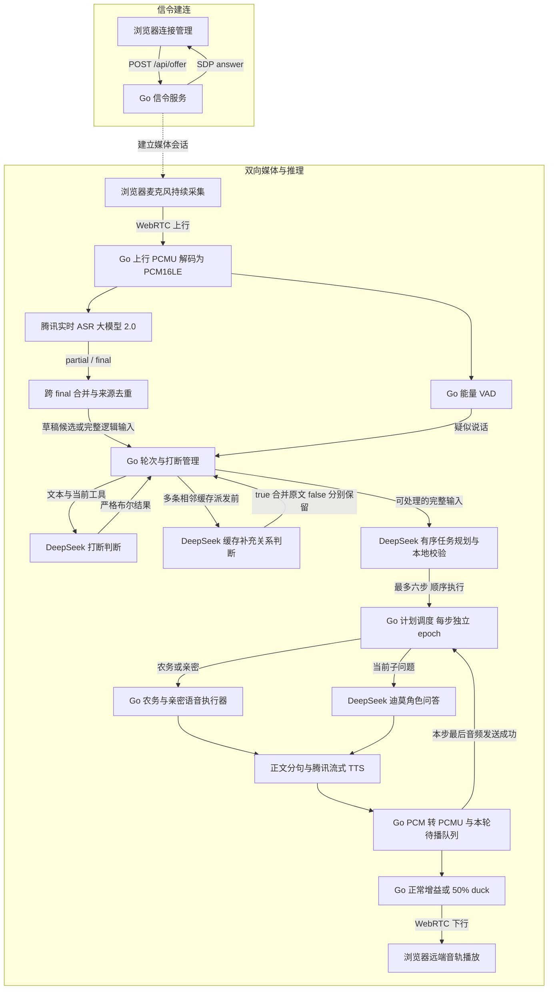
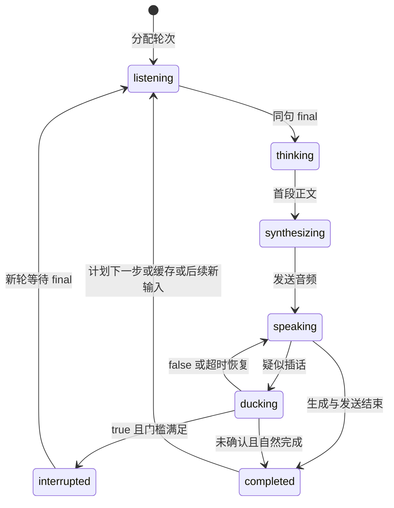
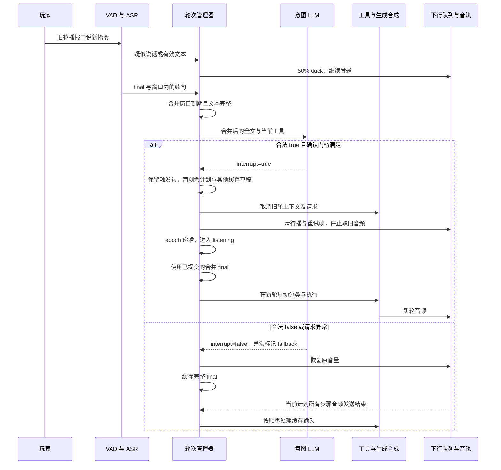

# 架构与状态机说明

## 链路图

offer 和 answer 都在 ICE 收集完成后发送。音频走 WebRTC 音轨；浏览器通过 DataChannel 接收服务端的字幕、工具、打断和队列状态。上行不会因为旧轮生成、下行播放、duck 或确认打断而停止。媒体为 PCMU / 8kHz / 单声道，服务端与 ASR/TTS 之间使用 PCM16LE。

ASR 当前配置为 `16k_zh_en_2.0`，用 `input_sample_rate=8000` 声明实际输入，腾讯云完成升采样。新版 `sentences.sentence_list` 转为统一的 partial/final 事件后进入轮次管理器。

轮次管理器持有非打断输入缓存，并控制下行增益、任务上下文、剩余计划和待播队列。false 的完整输入在整份计划结束后派发；true 清旧输入、取消当前及剩余步骤并清待播。普通 final 收集 800ms，等待表达 1400ms；收集时只 duck，提交完整逻辑输入后才请求意图 LLM。完整限制见 [dev 说明](dev-跨final合并与任务规划.md)。

缓存派发前还会检查相邻未执行输入的补充关系。例如故事加主题限制会合成一次请求，独立问题仍按顺序保留。这次判断发生在分配新响应 epoch 之前，通过 `input_relation` 记录队列状态；它不属于当前回答的 `thinking` 状态，也不能授权打断。每次最多等待 2 秒，停止/断开会取消请求。原始字幕保留来源句，合并输入另列。

## 打断状态机

图示以播放中插话为主路径。生成（`thinking`）或合成（`synthesizing`）期间也可进入 `ducking`；它是叠加候选状态，期间原任务继续推进，恢复时回到当时的工作阶段，不会重新分类或重启旧回答。

语音确认打断后分配新轮；`dev` 生产路径此时已取得合并后的 final，可以直接开始新请求。旧逻辑输入入口仍支持 partial 预留后等 final。手动停止也可取消尚在收集、还未分配轮次的输入。任务失败或 90 秒轮次超时从任意活动阶段进入 `failed` 并取消剩余计划。自然完成要求本轮生成已结束、音频全部发送且没有待实施的 true 确认。

初始 `ready` 表示空闲监听；页面在自然完成、失败或手动停止后可保持 `completed`、`failed`、`interrupted`，直到下个输入。断开会取消所有活动任务并关闭媒体会话。

单次 RTP 写入失败保留待发送帧供后续时钟重试，不立即变为 `failed`；取消轮次会一并清除这帧。图中展示服务可用时的业务状态，凭证未配置等启动条件见运行说明。

| 状态或事件 | 含义 |
| --- | --- |
| `listening` | 已分配当前轮次，等待触发句的 final |
| `thinking` | 正在分类工具或生成问答 |
| `synthesizing` | 已产出正文，正在获取合成音频 |
| `speaking` | 当前轮次处于音频播放阶段 |
| `ducking` | 疑似插话，音频按 50% 增益继续发送 |
| `interrupted` | 旧轮已停止 |
| `completed` | 本轮生成与音频发送结束 |
| `failed` | 当前任务因错误结束 |
| `intent_result` | 判定值、是否 fallback、请求耗时与原因 |
| `response_cancelled` | 旧轮取消、清除帧数、LLM/TTS 当时是否仍活动 |
| `turn_transition` | 旧、新 `response_epoch` 与保留的触发句 ID |
| `input_queue` | 待处理输入数量，确认打断清缓存时同步为零 |
| `input_merge` | 合并收集、提交或丢弃，携带所有 ASR 来源 ID |
| `input_relation` | 相邻缓存的补充关系、耗时与兜底；true 合并原文，false 保留两条 |
| `plan_status` | 整份计划状态、步骤序号和所有步骤的状态 |
| `plan_step_transition` | 自然完成后推进下一步，区别于语音打断切轮 |

## 确认打断时序

以上为设计时序，不是已录制的过程记录。具体阈值、取消边界与失败反思见 [实验报告](作业任务说明.md)，实现索引见 [其他技术说明](其他技术说明.md)。
