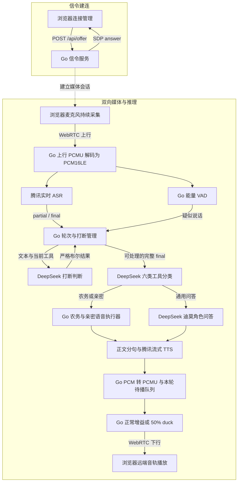
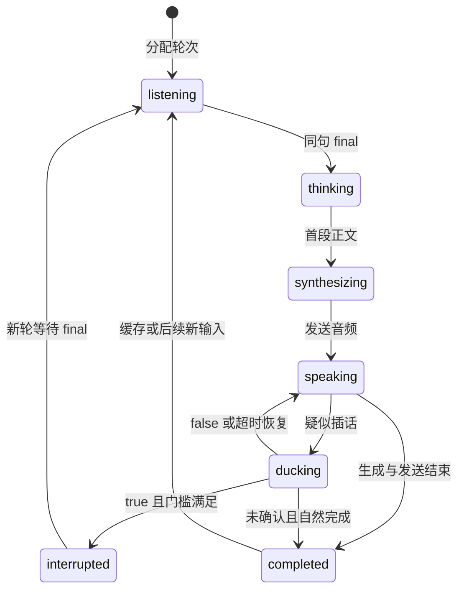
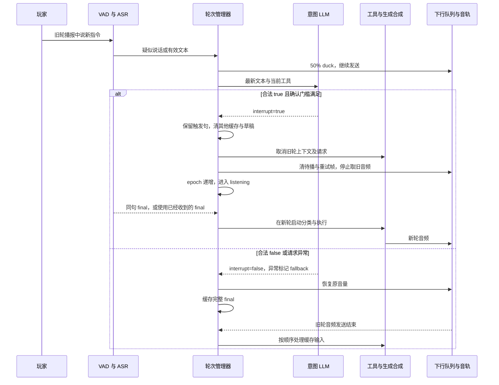

# 架构与状态机说明

## 链路图

offer 和 answer 都在 ICE 收集完成后发送。音频走 WebRTC 音轨；浏览器通过 DataChannel 接收服务端的字幕、工具、打断和队列状态。上行不会因为旧轮生成、下行播放、duck 或确认打断而停止。媒体为 PCMU / 8kHz / 单声道，服务端与 ASR/TTS 之间使用 PCM16LE。

轮次管理器持有非打断输入缓存，并控制下行增益、任务上下文和待播队列。false 的完整输入在旧轮音频发送结束后派发；true 清旧输入、取消旧任务并清待播。控制顺序见下方时序图。

## 打断状态机

图示以播放中插话为主路径。生成（`thinking`）或合成（`synthesizing`）期间也可进入 `ducking`；它是叠加候选状态，期间原任务继续推进，恢复时回到当时的工作阶段，不会重新分类或重启旧回答。

语音打断立即分配新轮并等待同句 final；手动停止可以发生在任意活动阶段，停止后等新输入再分配。任务失败或 90 秒轮次超时从任意活动阶段进入 `failed`，该期限包含等待 final、生成、合成与发送。自然完成要求本轮生成已结束、音频全部发送且没有待实施的 true 确认。

初始 `ready` 表示空闲监听；页面在自然完成、失败或手动停止后可保持 `completed`、`failed`、`interrupted`，直到下个输入。断开会取消所有活动任务并关闭媒体会话。

单次 RTP 写入失败保留待发送帧供后续时钟重试，不立即变为 `failed`；取消轮次会一并清除这帧。图中展示服务可用时的业务状态，凭证未配置等启动条件见运行说明。

| 状态或事件 | 含义 |
| --- | --- |
| `listening` | 已分配当前轮次，等待触发句的 final |
| `thinking` | 正在分类工具或生成问答 |
| `synthesizing` | 已产出正文，正在获取合成音频 |
| `speaking` | 当前轮次处于音频播放阶段 |
| `ducking` | 疑似插话，音频按 50% 增益继续发送 |
| `interrupted` | 旧轮已停止 |
| `completed` | 本轮生成与音频发送结束 |
| `failed` | 当前任务因错误结束 |
| `intent_result` | 判定值、是否 fallback、请求耗时与原因 |
| `response_cancelled` | 旧轮取消、清除帧数、LLM/TTS 当时是否仍活动 |
| `turn_transition` | 旧、新 `response_epoch` 与保留的触发句 ID |
| `input_queue` | 待处理输入数量，确认打断清缓存时同步为零 |

## 确认打断时序

以上为设计时序，不是已录制的过程记录。具体阈值、取消边界与失败反思见 [实验报告](作业任务说明.md)，实现索引见 [其他技术说明](其他技术说明.md)。
